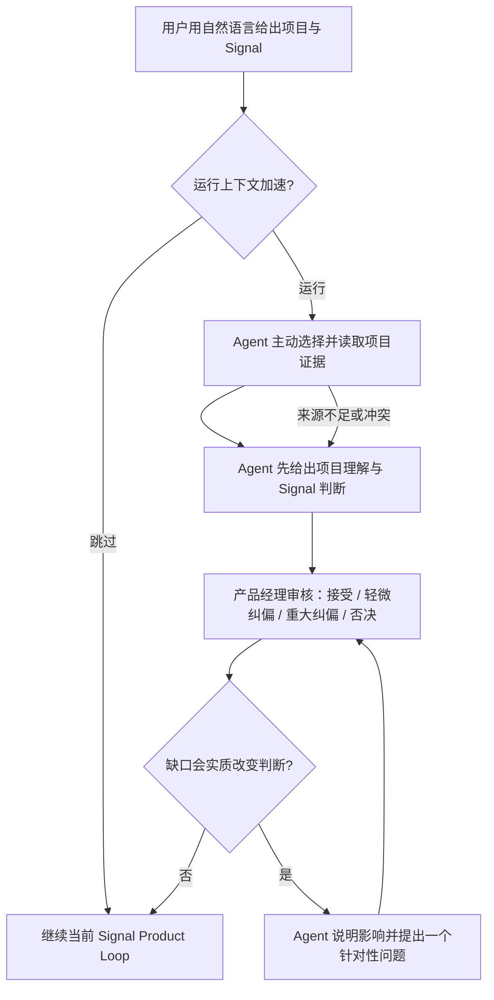

# BPG-PRD-BOOTSTRAP-CONTEXT-MVU-001_bootstrap-context-mvu_v0.1_2026-08-24

版本：v0.1｜状态：CANDIDATE｜交付意图：EXPERIMENT

## 阅读摘要

结论：先用一个单项目、单 Signal 的可回滚实验，验证 Agent-first Bootstrap 是否能把背景搬运降为零，并把产品经理的角色收敛为审核纠偏。

- **本次增量**：验证一个 Agent-first 的 Bootstrap Context MVU：Agent 先理解项目并判断新 Signal，产品经理只做审核纠偏。
- **主要对象、规模与场景**：1 名产品 Owner、1 个已有本地项目、1 条真实新 Signal、1 个不携带历史聊天背景的干净会话。
- **本期范围**：自然语言进入或跳过、Agent 主动理解、产品经理审核、审核后的理解用于当前 Signal。
- **明确不做**：固定问卷、自定义模板、Connector、Knowledge Graph、多用户权限、迁移、教学、身份、Git、Operational Readiness 和发布建设。
- **当前状态**：候选稿；实验尚未执行。
- **当前版本主要变化**：首次形成 Bootstrap Context MVU 实验 PRD。
- **下一步**：进入独立产品、工程可行性与可测试性审查；不得将候选稿或 Eval 设计表述为实验已经成功。

## 1. 问题、目标与价值

### 1.1 问题定义

- **主要驱动**：用户体验、产品判断质量、产品经理工作效率。
- **问题陈述**：产品经理在已有项目中使用 BPG 处理新 Signal 时，仍可能需要反复搬运背景或通过连续问答替 Agent 建立上下文。
- **主要对象与场景**：产品经理或项目 Owner 首次在已有项目中使用 BPG，或隔一段时间后带着新 Signal 回到项目。
- **现状与差距**：旧 Bootstrap 把项目理解与配置、治理和运行门禁混在一起；目标状态是 Agent 主动形成有依据的项目判断，再由产品经理审核。
- **不处理的后果**：首次价值延迟、分析脱离项目、重复提问，并继续把实现资源投入不相关的 Operational Readiness。
- **当前替代方式**：用户手动粘贴背景、解释历史决定或先完成大量配置，成本高且不可复用。

#### 1.1.1 目标对象规模与单位价值

本实验不估算市场规模。实验暴露严格限定为 1 名产品 Owner、1 个已有项目和 1 条 Signal；单位价值是产品经理是否能用一次审核替代大段背景复述。跨项目规模与商业价值属于实验后的新决策，不在本期伪造。

### 1.2 目标

- **GOAL-001**：在不要求用户先提供通用项目背景的前提下，Agent 能基于项目证据先形成可审核的项目理解与 Signal 语境判断。
- **对阶段目标的贡献**：直接验证 Bootstrap 是否能降低上下文搬运，而不是建立新的配置主线。
- **成功的可观察状态**：首次实质输出前背景搬运为 0；首次判断前通用背景问题为 0；重要判断可追溯或清楚标记不确定性；产品经理对核心语境无重大纠偏；跳过不阻断 Product Loop。
- **不能牺牲的边界**：Agent-first、自然语言进入、可跳过、来源可追溯、当前范围只读且不引入额外设置。
- **停止 / 改判条件**：出现通用背景前置提问、额外配置依赖、无来源且未标记的重要判断、核心语境重大误判或跳过后阻断时，停止扩展并返回产品决策。

| METRIC-ID | 指标 | 基线 | 实验判断标准 | 窗口 | 状态 |
|---|---|---|---|---|---|
| METRIC-001 | 首次实质输出前用户复制的项目背景字符数 | 待通过实验记录 | 0 | 单次实验会话 | 假设待验证 |
| METRIC-002 | 首次 Agent 判断前的通用背景问题数 | 当前流程曾出现先问再判断 | 0 | 单次实验会话 | 假设待验证 |
| METRIC-003 | 产品经理对核心项目目的、当前目标、非目标、Signal 关系的纠偏等级 | 未测量 | 不得为重大纠偏或否决 | 一次 Owner 审核 | 假设待验证 |
| METRIC-004 | 重要判断可追溯或已标记为推断、未知、冲突的比例 | 未测量 | 100% | 首次 Agent 产出 | 假设待验证 |
| METRIC-005 | 跳过后 Product Loop 是否可继续 | 未执行 | 是 | 同一实验会话 | 假设待验证 |

### 1.3 价值与时机

| 价值层 | 预期价值或不适用理由 | 证据 / 来源 | 结论状态 |
|---|---|---|---|
| 用户价值 | 减少背景搬运，把产品经理角色从信息录入者改为判断审核者 | Problem Definition Candidate；Owner 反馈 | 已确认方向，效果待验证 |
| 商业价值 | 当前没有可靠收入或增长证据，本实验不作商业收益承诺 | 当前绑定材料 | 不适用｜本期仅购买产品信息 |
| 团队 / 内部组织价值 | 降低每次产品讨论的冷启动成本并提高项目相关性 | Product Plan 与 Decision | 假设待验证 |

现在处理，是因为旧 Bootstrap 已出现范围膨胀，继续写完整方案会放大错误投入；一个单项目、单 Signal、可回滚实验能够用较低成本验证核心价值。

### 1.4 证据边界

- Owner 已确认核心目标、可跳过边界及 Agent-first / PM-review 原则。
- 旧文档直接证明此前范围同时包含多类不相关职责。
- 尚无真实实验结果证明 Agent 初判质量、纠偏成本或跨项目适用性；对应 ASM-001、ASM-002 与 UNK-001。

## 2. 范围与交付切片

### 2.1 本期范围

| SCOPE-ID | 能力 / 场景 | 用户结果 | 交付边界 |
|---|---|---|---|
| SCOPE-001 | 自然语言进入与显式跳过 | 无需记忆命令即可开始，也可继续原 Product Loop | 单项目、当前 Host、单 Signal |
| SCOPE-002 | Agent 主动项目理解 | 先看到有依据的项目与 Signal 判断 | 只使用当前可访问项目材料，不接 Connector |
| SCOPE-003 | 产品经理审核纠偏 | 审核 Agent 判断而不是回答问卷 | 一次审核；问题仅作高影响缺口兜底 |
| SCOPE-004 | 当前 Signal handoff | 审核后的理解用于当前 Signal | 不验证跨 Signal 长期持久化 |

### 2.2 明确不做

- 不设置固定项目字段、完整度分数或前置问卷。
- 不建设自定义需求模板、Connector、Knowledge Graph、多用户权限、迁移或教学主线。
- 不把身份、Git、Capability Ledger、Readiness、激活或发布作为 Bootstrap 完成条件。
- 不验证跨项目普适性、跨 Signal 持久化、自动刷新或远端知识源。
- 不在本 PRD 中修改正式 Product Loop、执行远程交付或宣称实验成功。

### 2.3 适用与兼容边界

- 适用对象：授权产品 Owner `eli` 的一次本地 dogfood 实验。
- 适用端：支持当前 BPG Skill 的 Host；自然语言是公共入口，不要求命令记忆。
- 语言：本次审核用中文；底层机器字段保持英文。
- 共享规则：运行 Bootstrap 和跳过 Bootstrap 都必须能进入同一当前 Signal Product Loop。

### 2.4 依赖与共享合同

| DEP-ID | 合同 | 消费模块 | Exact ref | 状态 |
|---|---|---|---|---|
| DEP-001 | bootstrap-optional-entry.v1 | bootstrap-entry、bootstrap-signal-handoff | Product Planning Node Result | 已确认 |
| DEP-002 | agent-first-review.v1 | bootstrap-understanding、bootstrap-review | Product Planning Node Result | 已确认 |
| DEP-003 | traceable-project-judgment.v1 | understanding、review、handoff | Product Planning Node Result | 已确认 |
| DEP-004 | question-as-fallback.v1 | bootstrap-review | Product Planning Node Result | 已确认 |

### 2.5 后续规划

跨 Signal 持久化与刷新、自定义模板设置、Connector、Knowledge Graph、多用户权限、迁移和教学均保留在 Product Plan 的 Future disposition。只有当前实验成功且出现对应独立证据时，才以新 Signal 重新决策；它们不扩大本期范围。Operational Readiness 明确停止并排除在 Bootstrap 主线之外。

## 3. 方案与功能规则

### 3.1 方案概述

当前切片由四个高内聚环节组成：自然语言进入或跳过；Agent 选择项目证据并形成判断；产品经理审核纠偏；审核后的理解进入当前 Signal。完成标准不是资料齐全，而是 Agent 是否已经能基于证据正确处理当前 Signal。

### 3.2 模块职责

| MOD-ID | 模块 | 职责 | 边界 |
|---|---|---|---|
| MOD-001 | bootstrap-entry | 识别自然语言意图并提供运行 / 跳过路径 | 不要求显式 new 或 bootstrap 命令 |
| MOD-002 | bootstrap-understanding | 主动选择来源并形成项目与 Signal 判断 | 不使用固定字段作为完成条件 |
| MOD-003 | bootstrap-review | 展示判断供 PM 接受、轻微纠偏、重大纠偏或否决 | 先产出后提问 |
| MOD-004 | bootstrap-signal-handoff | 将审核结果用于当前 Signal | 失败或跳过仍可继续 |

### 3.3 关键流程与交互视图

下图回答谁先行动、问题何时可以出现，以及跳过和失败如何回到 Product Loop。

关键边界：来源不足不会退化成空白问卷；Agent 先展示已发现内容、当前推断与缺口。产品经理拒绝回答时，Agent 保留未知并在安全范围内继续，或说明无法形成哪项判断。

### 3.4 业务规则

1. **RULE-001 Agent-first**：首次通用背景问题前必须已有基于项目证据的实质判断。
2. **RULE-002 Natural-language entry**：公共体验不得要求用户记忆稳定意图代码；Host 负责自然语言映射。
3. **RULE-003 Capability-based completion**：不以固定字段或文件数量判定完成，以当前 Signal 的正确语境判断能力判定。
4. **RULE-004 Traceability**：重要事实必须绑定来源；推断、未知、冲突、过期风险不得伪装成事实。
5. **RULE-005 Question as fallback**：只有缺口会改变当前判断时才提问，并同时说明决策影响；一次只提出一个最高价值问题。
6. **RULE-006 Optional**：用户跳过、拒绝回答或实验失败时，Bootstrap 不得阻断 Product Loop。
7. **RULE-007 Scope firewall**：模板、Connector、Knowledge Graph、权限、迁移、教学和 Operational Readiness 不得成为当前路径依赖。

### 3.5 交互、状态与权限

- 用户首先看到 Agent 结论、依据、未知与建议，而不是表单。
- 审核状态仅用于实验记录：`PRESENTED`、`ACCEPTED`、`MINOR_CORRECTION`、`MAJOR_CORRECTION`、`REJECTED`、`SKIPPED`。
- 只有产品 Owner `eli` 能提交本次审核结论；Agent 只能建议和记录。
- 本实验只读项目材料，不引入删除、远程发送或发布副作用。

### 3.6 分支与异常

| 场景 | 预期处理 | 用户可见结果 | 恢复 |
|---|---|---|---|
| 可用材料充分 | Agent 形成判断并引用来源 | 可审核的初步理解 | 审核后进入 Signal |
| 材料不足 | 展示已发现证据、临时判断和关键缺口 | 不伪装完整，不先抛问卷 | 必要时一个高影响问题，或跳过 |
| 来源冲突 / 过期 | 并列展示冲突与时效风险 | 不静默选择 | Owner 纠偏或保留未知 |
| 用户跳过 | 不生成完成门禁 | 当前 Signal 继续 | 无需恢复 |
| 用户拒绝回答 | 保留未知，说明影响 | 可继续部分判断或明确无法判断项 | 后续新证据触发再评估 |
| 核心语境重大误判 | 停止扩展实验 | 记录 STOP 证据 | 回到产品决策，不修饰为成功 |

### 3.7 验收标准

- **AC-001**：Given 用户在已有项目中用自然语言表达开始 BPG，When Host 解释意图，Then 不要求用户输入 `new` 或 `bootstrap` 才能进入实验。
- **AC-002**：Given 实验开始，When Agent 首次响应，Then 在任何通用背景问题前先给出基于项目材料的实质判断。
- **AC-003**：Given Agent 给出重要事实，When 产品经理查看依据，Then 每项事实都有来源，或被标记为推断、未知、冲突。
- **AC-004**：Given 项目材料不足，When Agent 无法确认判断，Then 先展示已知与缺口，不生成固定字段问卷。
- **AC-005**：Given 缺口不会改变当前判断，When Agent继续流程，Then 不向用户提问该缺口。
- **AC-006**：Given 缺口会改变当前判断，When Agent提问，Then 一次只问一个问题并说明决策影响。
- **AC-007**：Given 产品经理审核初判，When 提交纠偏，Then 记录审核等级和核心纠偏内容，不把 Agent 建议冒充 Owner 决定。
- **AC-008**：Given 审核完成，When 处理当前 Signal，Then 使用审核后的项目理解而非原始未审判断。
- **AC-009**：Given 用户选择跳过，When Product Loop 继续，Then 不要求模板、Connector、权限、Git 或 Readiness 前置步骤。
- **AC-010**：Given 出现来源冲突或过期风险，When Agent 综合，Then 用户能看到冲突双方和影响。
- **AC-011**：Given 发生停止条件，When 实验结束，Then 返回 STOP 或 ADJUST 证据，不产生发布或成功声明。
- **AC-012**：Given 实验记录完成，When 结果返回产品决策，Then 结果以 `bootstrap-context-experiment-result.v1` 的确切路径、hash、version 绑定。

## 5. 验收与产品评估

### 5.1 整体验收边界

最低条件是 AC-001 至 AC-012 均有可观察证据，并由产品 Owner 对 METRIC-003 提交审核结论。文档或 schema 验证不能替代真实干净会话、Agent 行为和 Owner 审核。回归范围是自然语言意图映射、现有 Signal Intake、跳过路径和 Product Loop 连续性。

| GOAL / SCOPE | MOD / RULE | AC | Eval / 状态 |
|---|---|---|---|
| GOAL-001 / SCOPE-001 | MOD-001 / RULE-002、006 | AC-001、009 | Product Eval 必须提供；NOT_RUN |
| GOAL-001 / SCOPE-002 | MOD-002 / RULE-001、003、004 | AC-002 至 AC-004、010 | Product Eval 必须提供；NOT_RUN |
| GOAL-001 / SCOPE-003 | MOD-003 / RULE-005 | AC-005 至 AC-007 | Product Eval 必须提供；NOT_RUN |
| GOAL-001 / SCOPE-004 | MOD-004 / RULE-006 | AC-008、011、012 | Product Eval 必须提供；NOT_RUN |

### 5.2 Product Evals 适用性

- **适用性**：必须提供 Evals。
- **理由**：关键结论依赖 Agent 产品判断质量、提问顺序、证据区分和 Owner 纠偏，普通 schema 或单元测试不能证明。
- **准备状态**：REVIEW_PENDING；本步骤未执行 Eval，也没有独立审查结论。
- **执行状态**：NOT_RUN。
- **需要的独立输入**：一个不携带历史聊天的干净会话、固定项目快照、原始 Signal、首次 Agent 输出、完整交互记录和 Owner 审核结果。

### 5.3 实验型交付合同

| 合同项 | 内容 |
|---|---|
| 关键未知 / 假设 | ASM-001、ASM-002、UNK-001 |
| 本次受控变化 | 增加 Agent-first 的可跳过上下文加速体验；原 Product Loop、模板和运行门禁保持不变 |
| 暴露对象 | 产品 Owner `eli`；1 个真实本地项目；1 条新 Signal；1 个干净会话 |
| 关联范围 / 指标 | SCOPE-001 至 004；METRIC-001 至 005 |
| 判断窗口 | 2026-08-24 开始；完成 1 次有效实验或到 2026-09-07，以先发生者为准 |
| 监控 | 每一步记录时间、用户复制背景字符数、问题、来源状态、审核等级、异常和跳过结果 |
| Kill / 回滚 | 任一停止条件立即终止实验；不提升为默认 Bootstrap，保留原 Product Loop |
| Owner | `eli`；只有 Owner 可审核实验结果并作下一次 Product Decision |
| Typed result return | `bootstrap-context-experiment-result.v1` 作为不可变本地 artifact，以 exact path/hash/version 返回新的产品决策 Run |

Typed result 至少包含：实验实例 ID、结束状态 `CONTINUE / ADJUST / STOP / INCONCLUSIVE`、METRIC-001 至 005 的观测值、重要判断总数与可追溯数、问题及其决策影响、Owner 审核身份与时间、完整 evidence refs。不得只有自然语言结论。

| 结果类型 | 后续动作 |
|---|---|
| CONTINUE | 返回产品决策，评估是否进入完整规划；不能自动扩大范围 |
| ADJUST | 形成具体行为差距，修订实验后再次决策 |
| STOP | 结束当前方向或重新定义问题 |
| INCONCLUSIVE | 补足有效实验输入，不声明成功或失败 |

### 5.4 测试设计参考

未来测试设计应覆盖自然语言入口、Agent-first 顺序、来源标注、材料不足、冲突 / 过期、问题门槛、Owner 审核、拒答、跳过、handoff 和 typed result。测试设计与 Eval Pack 当前均未执行，不能表述为 PASS。

## 6. 非功能性要求

- **性能**：不设置未经验证的时延承诺；记录从 Signal 到首次实质判断的时间，作为后续量化依据。
- **稳定性与恢复**：单一来源读取失败不得导致虚假完整；保留缺口并允许跳过。重复运行不得覆盖既有实验证据。
- **安全、权限与隐私**：只读取 Host 当前授权的项目材料，不接远端 Connector，不发送外部，不扩大用户权限。不得将项目材料原文无差别复制进结果。
- **可观测性**：保存步骤时间、来源 refs、问题、审核等级、停止原因和 typed result。
- **无障碍**：不适用｜理由：本实验不新增图形界面；文本输出保持清晰标题和可读顺序。

## 7. 兼容、灰度、降级与回滚

- **兼容**：原 Signal Intake 与 Product Loop 保持可用；Bootstrap 是附加且可跳过的路径。
- **灰度**：仅 `eli`、单项目、单 Signal、干净会话；没有外部用户或自动扩量。
- **扩量条件**：本实验只返回新的产品决策，不自动扩量。
- **暂停条件**：任何停止条件、无法形成干净输入、证据记录不完整或 Owner 不可用。
- **降级**：Bootstrap 不可用时直接进入原 Product Loop，并清楚提示缺少项目理解可能带来的限制。
- **回滚**：停止实验、保留证据、不改变默认产品规则、不发布候选 PRD。Owner：`eli`。

## 8. 数据上报与分析影响

本实验不新增远程遥测或 BI。所有测量保存在项目本地实验结果中，只记录 METRIC-001 至 005 所需的最小数据；不得把项目背景原文作为分析数据。数据完整性通过 exact evidence refs、计数与 Owner 审核记录核对。

## 9. 多语言、文案与内容呈现

默认面向产品经理使用中文，机器字段与状态枚举保留英文。用户可见顺序必须是：Agent 结论与建议 → 依据与未知 → 产品经理审核动作 → 必要时一个高影响问题。禁止以“请先补充项目背景”作为默认首屏。

## 10. 跨团队与上线配套

当前仅本地 dogfood，不涉及客服、市场、社区、培训、法务批准或远程上线。产品、Eval Reviewer 和后续工程 / 测试参与者只以当前 PRD、Eval Pack 和 exact refs 协作；实验前不得把候选稿称为已发布。法律、合规与内容安全无新增外部处理或用户暴露，当前材料未发现需要专业审批的已知硬性事项，但这不等于独立合规审计已经完成。

## 11. 风险、假设与未决事项

### 11.1 主要风险

| RISK-ID | 风险 | 发生信号 | 影响 | 缓解 / 停止 | Owner |
|---|---|---|---|---|---|
| RISK-001 | Agent 生成看似完整但通用的摘要 | 与当前 Signal 无具体关系 | 实验假阳性 | 要求来源和 Signal 关系；重大误判即 STOP | Product |
| RISK-002 | 使用过期或冲突材料 | Owner 指出历史决定已失效 | 错误判断 | 暴露时效与冲突，不静默合并 | Product |
| RISK-003 | 流程再次退化为问卷 | 首次判断前出现通用背景问题 | 违背核心原则 | AC-002 失败即 STOP | Product/Host |
| RISK-004 | 历史聊天污染实验 | Agent 获得本不应存在的上下文 | 结果不可解释 | 使用干净会话和固定输入；否则 INCONCLUSIVE | Eval Owner |
| RISK-005 | 单次成功被误当作普遍证明 | 请求直接默认上线 | 范围失控 | typed result 只能返回新 Product Decision | Owner |

### 11.2 假设与未知

| ID | 类型 | 内容 | 影响 | 当前处理 | 改判条件 | Owner / 来源 |
|---|---|---|---|---|---|---|
| ASM-001 | 假设待验证 | 真实项目内已有足够材料支持初步判断 | SCOPE-002 | 本实验验证 | 来源不足迫使用户重述背景 | Product / 实验证据 |
| ASM-002 | 假设待验证 | 审核 Agent 初判的成本低于重新讲述项目 | SCOPE-003 | 记录纠偏等级和背景搬运量 | 重大纠偏或大量补充 | Owner `eli` |
| UNK-001 | 未知 | 哪类来源优先级与刷新策略可跨项目复用 | 不阻塞单项目实验 | 保留未知 | 当前实验成功后出现第二个代表性项目 | 新 Product Decision |
| UNK-002 | 未知 | 一次实验是否能证明长期跨 Signal 复用 | 不在本期范围 | 不作结论 | 出现第二条真实 Signal | Roadmap / 新 Signal |

### 11.3 待确认事项

| OPEN-ID | 来源 | 需要确认 | Owner | 未完成影响 | 最晚确认点 |
|---|---|---|---|---|---|
| OPEN-001 | ASM-002 / METRIC-003 | 对首次判断提交接受、轻微纠偏、重大纠偏或否决，并说明核心纠偏 | `eli` | 无法判断实验结果 | 实验会话结束时 |
| OPEN-002 | Product Evals | 独立 Reviewer 审查 Eval Pack 与证据绑定 | Eval Reviewer | PRD 不能 Ready / Release | Ready Gate 前 |

## 附录 A：支撑材料

- `.better-product-graph/runs/run-f9b68b8e69c7/artifacts/problem-definition-candidate-v1.md`
- `.better-product-graph/runs/run-f9b68b8e69c7/artifacts/PRODUCT_PLAN_BOOTSTRAP_CONTEXT_MVU_v0.1.md`
- `.better-product-graph/decisions/decision-f9b68b8e69c7/DECISION_v1.json`
- `docs/bootstrap/PRD_GRAPH_BOOTSTRAP_v0.1.md`
- `docs/roadmap/BETTER_PRODUCT_GRAPH_ROADMAP_v0.13.md`

## 附录 B：决策与变更依据

| 决策项 | 结论 | Exact ref / Owner | 日期 | 影响 |
|---|---|---|---|---|
| Bootstrap 核心问题 | 快速建立项目理解，减少上下文搬运 | Problem Definition Candidate / Owner | 2026-08-22 | 删除配置与治理主线 |
| 交互责任 | Agent 先判断，产品经理审核；问题只作兜底 | problem.learning.loop / Owner | 2026-08-22 | 形成 RULE-001、005 |
| 产品结果 | 先做最小实验 | Decision v1 / Owner `eli` | 2026-08-24 | delivery intent = EXPERIMENT |

## 附录 C：文档变更日志

| PRD 版本 | 日期 | 变更人 | 主要变更 | 变更类型 | Supersedes | Review / Release 影响 |
|---|---|---|---|---|---|---|
| v0.1 | 2026-08-24 | Codex Host Agent | 首次形成 Bootstrap Context MVU 实验候选 PRD | 产品语义 / 表达 | 无 | 进入候选审查；实验与 Evals 均 NOT_RUN |

## 附录 D：交付检查与覆盖索引

| 检查项 | 结论 | 正文位置 / 证据 | Owner | 下一动作 |
|---|---|---|---|---|
| Product Evals | 必须提供；REVIEW_PENDING / NOT_RUN | 第 5.2 节 | Eval Reviewer | 生成并独立审查 Eval Pack |
| 实验型交付合同 | 已建立，尚未执行 | 第 5.3 节 / ASM-001、002 | `eli` | 执行后返回新 Product Decision |
| 测试设计参考 | 已在正文简述，NOT_RUN | 第 5.4 节 / AC-001 至 012 | Engineering/Test | 后续形成测试设计 |
| 数据与 BI | 仅项目本地最小记录，不新增远程遥测 | 第 8 节 | Product | 验证 exact refs 完整性 |
| 多语言 / 无障碍 | 中文文本适用；无新增 GUI | 第 6、9 节 | Product | 保持可读顺序 |
| 法律、合规、第三方与外部同步 | 当前不涉及外部暴露或新第三方；未完成独立合规审计 | 第 10 节 | Product | 范围变化时重审 |
| 项目专属检查 | Agent-first、自然语言进入、可跳过、来源可追溯 | RULE-001 至 007 | Product Owner | 由 Eval 覆盖 |
