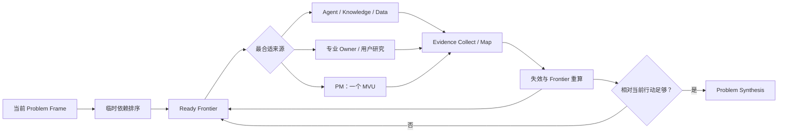

# BPG-PRD-LEARNING-FRONTIER-001_dependency-aware-learning-pilot_v0.3_2026-08-24

## 阅读摘要

结论：本期应在既有 `problem.learning.loop` 内吸收依赖感知方法，但只交付可回滚的 Prompt-only Pilot，不新增顶层节点或第二套状态系统。

- **本次增量**：在既有 `problem.learning.loop` 内加入轻量依赖排序、Ready Frontier、来源分流和证据后重算，使复杂需求少问错问题、少被无关等待拖住。
- **主要对象、规模与场景**：使用 Better Product Graph 做问题发现的产品经理，尤其是需要 AI 辅导的 Junior PM；本期覆盖复杂度从 LIGHT 到 STANDARD 的 Discovery Run，真实用户规模待 Pilot 建立基线。
- **本期范围**：只交付 Prompt-only Pilot、安装版公开指令和 G1—G7 可执行 Golden Matrix；LIGHT 先短路，复杂场景只在一个尚未提交的 Host attempt 内临时排序、顺序查证并最多重算一次。
- **明确不做**：不新增顶层 Node、独立或专用 Grilling Agent、正式 Dependency Map、状态 Schema、真实跨提交 WAIT / resume 或跨 Host 并发平台。
- **当前状态**：v0.3 候选稿；两轮独立审查共 12 条意见均已形成 disposition 并吸收进新版本，第三轮复审、测试、安装和发布仍尚未完成。
- **授权边界**：当前 Run 冻结的 Decision / Plan 只授权形成规划，不代表已经授权实现、安装或发布；未作为 exact、versioned、hash-bound Run input 的聊天内容不得被升级成施工授权。
- **当前版本主要变化**：关闭第二轮六条意见：移除 v0.2 尾部控制文本；撤回未绑定施工授权；把 Prompt-only 的输出边界改成受控 Host 约束而非虚假的 Controller hard enforcement；补全 G6 skip → exact Evidence → resume oracle。
- **下一步**：完成 exact Candidate v0.3 的独立复审；Ready 后进入授权判断，不自动进入 TDD、安装或发布。

## 1. 问题、目标与价值

### 1.1 问题定义

- **主要驱动**：产品经理工作质量、AI 辅导能力、Discovery 效率。
- **问题陈述**：BPG 已能围绕一个 MVU 学习，但面对多个相互依赖的未知和多个信息来源时，尚未明确怎样避免过早提问、无关等待和新证据后的旧问题残留。
- **主要对象与场景**：使用 BPG 处理复杂 Idea、用户反馈或 Issue 的产品经理；一次 Discovery 同时涉及历史 Decision、项目数据、专业 Owner、用户研究和 PM 私有背景。
- **现状与差距**：现有循环能选择当前 MVU 和来源，但没有清楚外显前置依赖、当前可行动集合、等待隔离和失效重算策略。简单需求已足够轻，复杂需求的调度解释不足。
- **不处理的后果**：AI 可能在事实尚未确认时要求 PM 做下游判断；一个外部等待拖住整轮；新证据已推翻上游假设但旧问题仍被继续追问；Junior PM 被迫自己排序一面问题墙。
- **当前替代方式**：Host Agent 临时凭上下文决定先后顺序；跨轮次的理由不稳定，也缺少可重复的 Golden Case 验证。

#### 1.1.1 目标对象规模与单位价值分析

当前没有可靠用户规模基线。Pilot 不以虚构数量作为前提。

- **目标对象**：BPG 的产品经理使用者，尤其是 Junior PM。
- **单位价值**：减少一次不合时宜的 PM 打断、一次无效等待或一次因旧问题残留造成的认知返工。
- **状态**：待验证｜Owner / 有效来源：Pilot 运行记录与人工 PM 可理解性复核｜影响：决定是否进入可恢复状态设计，不阻止本期 Prompt-only Pilot。

### 1.2 目标

#### 1.2.1 定性目标

- **目标 ID**：GOAL-001
- **本次产品目标**：让复杂 Discovery 中的下一项学习行动具有可解释的依赖顺序，并把 PM 交互压缩为真正需要人类判断的一个核心 MVU。
- **对上层 / 阶段目标的贡献**：验证 Grilling 的依赖调度机制是否能补强 BPG，而不破坏 BPG 已确认的 MVU、交互预算和 action-relative sufficiency。
- **成功的可观察状态**：G1—G7 中，Agent 能区分前置、并行、等待和失效；简单路径不增加持久状态或额外 HITL；复杂路径能说明“为什么现在做这一项”。
- **不能牺牲的目标边界 / 护栏**：不新增顶层 Node、独立或专用 Grilling Agent、正式业务 Artifact、Owner 授权或第二状态真源；不把 Agent 推断、多 Agent 共识或 PM claim 冒充 Evidence。
- **停止 / 改判条件**：如果简单路径显著变重、相同输入依赖判断不稳定，或调度错误比现有 MVU-only 机制造成更多返工，则移除本期提示并恢复现状。

#### 1.2.2 定量目标

不适用｜理由：当前没有真实基线，直接承诺百分比会制造虚假精确性｜替代的可观察证据：记录 G1—G7 的 PM 打断、前置错误、无关等待、失效重算和人工可理解性｜重新评估量化的触发条件：完成首轮 Pilot 并形成基线分布。

### 1.3 价值与时机

#### 1.3.1 三层价值

| 价值层 | 预期价值或不适用理由 | 证据 / 来源 | 结论状态 |
|---|---|---|---|
| 用户价值 | PM 更少被当作搜索框，Junior PM 能看到 AI 的专业判断、反方和改判条件 | Product Plan §2、§10；现有 Problem Learning 决策 | 假设待验证 |
| 商业价值 | 暂无可靠商业量化；潜在价值是减少错误产品决策与返工 | Pilot 后续运行证据 | 待验证 |
| 团队 / 内部组织价值 | 复杂 Discovery 的顺序、等待和停止理由更容易审计和复盘 | Product Plan §8、§12、§19 | 假设待验证 |

#### 1.3.2 为什么现在处理

- **当前触发 / 时机**：BPG 主流程已能稳定运行，当前缺口集中在复杂 Problem Learning 的调度质量；外部 Grilling Skill 提供了可借鉴的方法，但尚未被证明适合完整照搬。
- **延迟的成本 / 风险**：继续只靠 Host 临时判断，会反复出现顺序不透明和复杂任务全局等待，也无法判断是否真的需要未来的持久 Dependency Map。
- **确切依据**：`docs/product-plans/archived/BETTER_PRODUCT_GRAPH_DEPENDENCY_AWARE_LEARNING_PLAN_v0.1.md` 及 Decision `decision-d88905b2d143@v1`。

### 1.4 证据边界

| 证据类型 | 支撑或限制的判断 | Exact ref / 来源 | 可靠性、缺口或验证边界 | 关联 ID |
|---|---|---|---|---|
| 已确认事实 | BPG 已有 Assumption Audit、MVU、来源路由、一次一个 PM 核心问题和 action-relative sufficiency | 当前 Released BPG PRD；Decision `decision-d88905b2d143@v1` | 约束本期不能另造一套 Discovery Graph | 无 |
| 当前 provisional 规划 | 当前激活 Slice 指向 Prompt-only Pilot | Product Plan v0.1；`slice-learning-frontier-pilot` | 已被 Controller 接受为本 Run 规划输入，但不是 Owner 的实现、安装或发布授权 | SCOPE-001—007 |
| 假设性依据 | 依赖排序和 Frontier 重算能减少过早提问与无关等待 | Product Plan G2—G5 | 尚无真实运行收益 | ASM-001 |
| 未知 / 证据缺口 | Prompt-only 状态能否跨恢复保持稳定 | Product Plan OQ-01 | 决定是否进入后续 State Slice，不阻止本期 | UNK-001 |

## 2. 范围与交付切片

### 2.1 本期范围

| SCOPE-ID | 本期确定交付的能力 / 场景 | 用户结果 | 交付边界 |
|---|---|---|---|
| SCOPE-001 | LIGHT 快速路径 | 简单需求继续直接查证或只问一个问题 | 进入 Learning 后第一步判定并短路；不先枚举完整依赖，不增加持久状态 |
| SCOPE-002 | 临时依赖排序与 Ready Frontier | 复杂需求先满足会改变下游判断的前置 | 只存在于一个尚未提交的 Host attempt 内；现有结果字段仅保留简短选择理由 |
| SCOPE-003 | 来源分流 | 能由 Agent、Knowledge、History、Data 或专业 Owner回答的内容不默认问 PM | 不新增 Connector 或专业审批权 |
| SCOPE-004 | 逻辑等待隔离 | 一个来源暂时不可得时，Host 在同一未提交 attempt 内先顺序完成独立可查事项 | 不产生正式 WAIT 状态，不承诺跨提交 resume 或真实并发；需要外部等待时沿用现有 Learning 路径 |
| SCOPE-005 | 一个 PM-facing MVU | PM 每次只看到当前判断、一个核心问题、Agent 建议、最强反方和改判条件 | 不展示完整 Frontier，不连续抛出问题墙 |
| SCOPE-006 | 新证据后的临时失效与重算 | 同一 attempt 内新查得的 exact Evidence 推翻前提时，不再机械追问旧问题 | 最多重算一次；不新增持久 invalidated / superseded 字段，跨提交重算后置 |
| SCOPE-007 | 相对行动充分性 | 仍有长期 Unknown 时也可负责任地进入 Synthesis | Frontier 非空不自动阻塞；停止理由必须可审计 |

### 2.2 明确不做

- 不新增 `grilling`、`dependency.map`、`frontier.compute` 等顶层 Graph Node。
- 不新增独立或专用 Grilling Agent；只允许既有 Host Agent 在 `problem.learning.loop` 内使用该语义方法。
- 不新增正式 Dependency Map Artifact、State Schema、数据库或第二状态控制器。
- 不实现真实跨提交 WAIT / resume，也不实现跨 Host 多 Agent 平台或正式并发 fan-out / join。
- 不改变 `product.decision` 的 Owner 授权边界。
- 不让程序选择 MVU、生成产品判断或推断 Evidence。
- 不把问题清单全部展示给 PM，不采用持续施压式追问风格。
- 不以 Frontier 清空、所有 Unknown 消失或研究次数作为停止标准。

### 2.3 适用范围与兼容边界

- **适用用户 / 组织**：所有使用 BPG Problem Discovery 的 Host；重点验证 Junior PM 场景。
- **适用端与版本**：BPG skills-only 本地插件；当前切片不依赖 MCP、服务或数据库。
- **地域 / 语言 / 市场**：产品逻辑与语言无关；当前公开指令使用中英混合稳定 machine name，中文解释优先。
- **共享规则**：Incident 和已确认 Implementation Deviation 不进入本增强；它们继续走既有轻路径。
- **需要拆分的差异**：真正并发执行、跨会话持久状态和跨 Host 多 Agent 分别属于后续 Slice，不进入本 PRD。

### 2.4 依赖与共享合同

| DEP-ID | 依赖 / 共享合同 | 类型 | Exact ref | 状态 | 影响与处理 |
|---|---|---|---|---|---|
| DEP-001 | 现有 `problem.learning.loop` Host 合同 | 前置依赖 | 当前安装版 node contract / instruction | 已确认 | 本期只增强内部方法，不改变顶层路由 |
| DEP-002 | `learning-focus-contract.v1` | provisional 共享规则 | Product Plan §16 | 待本 PRD 复审 | 内部可有多个候选，但 PM-facing 只外显一个 MVU |
| DEP-003 | `learning-evidence-authority.v1` | provisional 共享规则 | Product Plan §16 | 待本 PRD 复审 | 只有 exact Evidence 能让临时候选变成 resolved / invalidated / superseded；一期不新增持久字段 |
| DEP-004 | `learning-action-sufficiency.v1` | provisional 共享规则 | Product Plan §16 | 待本 PRD 复审 | Frontier 非空不自动阻止 Synthesis |
| DEP-005 | G1—G7 Golden Cases | provisional 验证依赖 | Product Plan §19.1、本 PRD §5.5 | 待 installed-path 执行 | 以本 PRD 的冻结输入和唯一 oracle 为准 |

### 2.5 后续规划与演进脉络

| 后续方向 / 预期结果 | 与当前切片的关系 | 规划状态 | 触发条件 | 当前切片必须保留的边界 |
|---|---|---|---|---|
| 最小可恢复依赖状态 | 只在 Prompt-only 无法稳定恢复时补充 | 条件触发，未承诺 | Pilot 证明跨会话恢复或多 Evidence Request 不足 | Frontier 是派生视图，不成为第二真源 |
| 并行 Evidence 调度 | 把本期逻辑非阻塞升级为有界真实并行 | 条件触发，未承诺 | sub-agent 身份、冻结输入、timeout、join 已验证 | 主 Agent 单点整合，分歧不能被投票抹平 |

## 3. 方案总览与关键流程

### 3.1 方案概述

本期不改变用户看到的 BPG 主流程。进入 `problem.learning.loop` 后，Host **先做 LIGHT 短路**：只有一个行动改变型 Unknown、没有前置冲突且不需要外部等待时，直接沿用现有 MVU / 来源路由，不枚举依赖。只有复杂路径才在同一个尚未提交的 Host attempt 内临时排列会改变下一行动的 Unknown、Judgment 和 Authorization，派生 Ready Frontier，并顺序查询可自助获得的来源。真正需要 PM 时只呈现一个 MVU。若同一 attempt 内取得的新 exact Evidence 推翻前提，最多重算一次；无新 Evidence 或 MVU 未变化即视为无进展，停止重算并回到现有路径。当剩余未知已不会改变当前行动及其风险、可逆性、测量和回滚边界时，允许进入 Synthesis。

### 3.2 模块概览

| MOD-ID | 模块 | 在本增量中的职责 | 本期角色 / 交付边界 | 关联 DEP-ID |
|---|---|---|---|---|
| MOD-001 | Learning Dependency Model | 临时表达前置、独立、失效和取代关系 | Host 内部方法；不持久化正式 Map | DEP-001、003 |
| MOD-002 | Frontier Scheduler | 派生当前可行动集合并选择下一 MVU | Agent 语义判断；程序不代替 | DEP-002、004 |
| MOD-003 | Source Executor | 把问题交给最合适来源并隔离等待 | 逻辑非阻塞；不承诺真实并发 | DEP-003 |
| MOD-004 | Interaction Renderer | 将内部复杂度压缩成一个 PM 问题 | 当前判断 + 建议 + 反方 + 改判条件 | DEP-002 |
| MOD-005 | Learning Rationale | 用现有 `next_actions[].reason` 与 `reasoning_usage.selection_rationale` 保留简短选择/停止理由 | 不新增依赖、WAITING、invalidated、superseded 持久字段，不声称跨提交可恢复审计 | DEP-003、004 |

### 3.3 关键流程与交互视图

- **视图目的与范围**：说明一次 Learning Round 怎样从当前认知走到下一行动；不覆盖 Product Decision、Planning 或 PRD 后续流程。
- **核心行为与关系**：临时排序 → Frontier → 来源分流 → Evidence Map → 重算 → 继续或 Synthesis。
- **关键边界与判断**：PM 不是默认来源；每次最多一个核心 MVU；Frontier 非空不等于必须继续。
- **异常与降级**：依赖环、排序不稳定、无新 exact Evidence 或一次重算后 MVU 不变时，停止临时调度并降级到现有 MVU + 来源路由；一期不生成正式 WAIT / resume 或跨提交失效记录。

### 3.4 全局产品规则、状态与权限

| ID | 规则 / 状态 / 权限 | 适用范围 | 来源 | 冲突处理 |
|---|---|---|---|---|
| RULE-001 | LIGHT 判定是进入 Learning 后第一步；满足条件时立即短路，不先枚举完整依赖，也不新增用户打断 | Problem Learning | Product Plan §9 | 出现多个会改变行动的前置或冲突时才临时升级 |
| RULE-002 | 只有会改变当前行动或风险边界的事项才进入 Ready Frontier | Problem Learning | Product Plan §8.4 | 低价值事项不占据 MVU |
| RULE-003 | PM-facing 每轮只允许一个核心 MVU | PM Interaction | HD-09 / learning-focus | 多个问题拆轮或由 Agent 自查 |
| RULE-004 | 临时 `resolved / invalidated / superseded` 判断必须绑定 exact Evidence、Judgment 或 Authorization 来源；一期只在 Host attempt 内生效 | 全部 Learning | learning-evidence-authority | 无来源时保持 Unknown |
| RULE-005 | 一个暂时不可得来源不能阻止同一未提交 attempt 内其他独立自助查证；不得声称正式 WAIT 或并发 | Source routing | Product Plan §8、§20 | 需要跨提交等待时沿用现有 Learning 路径 |
| RULE-006 | 停止由 action-relative sufficiency 决定，不由 Frontier 是否为空决定 | Learning completion | HD-12 | 会改变当前行动的未知仍存在时不得 Ready |
| RULE-008 | Phase 1 在一个 Host attempt 内最多重算一次；没有新 exact Evidence 或 MVU 未变化时，停止重算并降级 | Problem Learning | ENG-FEAS-003 | 不得循环消耗或伪造进展 |
| RULE-007 | Controller 只校验合同与迁移，不生成依赖、选择 MVU 或写产品建议 | Agent / Controller | HD-03 | 语义判断留给 Host Agent |

## 4. 功能与规则详述

### 4.1 MOD-001｜Learning Dependency Model

#### 4.1.1 模块目标与用户故事

- **模块目标**：让 Host 在复杂 Learning Round 内知道哪些事项有前置、哪些可独立推进、哪些已失效或被取代。
- **用户故事**：作为产品经理，我希望 AI 不在上游事实未清楚时让我做下游选择，从而避免把猜测包装成产品判断。
- **触发与前置条件**：Assumption Audit 已给出可信起点和当前 MVU；Host 判断存在多个会改变行动的事项或外部等待。
- **退出 / 完成条件**：LIGHT 已直接短路，或复杂路径的最小临时关系足以选择下一行动；不要求画满整个问题空间。

#### 4.1.2 业务规则

1. **RULE-101**：一期只需要 `REQUIRES_EVIDENCE / REQUIRES_JUDGMENT / REQUIRES_AUTHORIZATION / INVALIDATED_BY / SUPERSEDES / INDEPENDENT_OF` 六类关系。
2. **RULE-102**：依赖必须服务于当前行动判断；不得为了结构完整而补伪依赖。
3. **RULE-103**：形成依赖环或相同输入无法稳定排序时，明确说明冲突并降级到现有 MVU 机制。
4. **RULE-104**：LIGHT 先于依赖枚举；简单场景不得为了证明新能力而构造 Frontier。

#### 4.1.3 分支与异常

| 场景 / 条件 | 预期处理 | PM 可见结果 | 记录 / 恢复方式 |
|---|---|---|---|
| LIGHT | 在任何完整依赖枚举前直接短路 | 不展示依赖结构，也不增加提问 | 复用现有 MVU / 来源路由 |
| 多个前置 | 只保留会改变行动的最小关系 | 只解释当前问题为何现在可问 | 复用当前 Learning State |
| 依赖环 / 不稳定 | 不猜顺序，降级到现有 MVU | 说明当前冲突与建议补证 | 记录降级原因 |

#### 4.1.4 验收标准

- **AC-101**：Given G1 简单需求，When Host 进入 Learning，Then 第一步命中 LIGHT，在依赖枚举前短路，不创建持久 Dependency Map、不增加 PM 打断，默认下一行动与基线一致。
- **AC-102**：Given G2 用户直接提出“一键清空”，When 上游问题尚未确认，Then 按钮位置等下游问题不进入当前 Frontier。
- **AC-103**：Given 新证据推翻上游假设，When 重算依赖，Then 所有依赖旧假设的下游问题被标记为失效或被取代。

### 4.2 MOD-002｜Frontier Scheduler

#### 4.2.1 模块目标与用户故事

- **模块目标**：从已满足前置的事项中选择当前最有行动价值的一个 MVU。
- **用户故事**：作为产品经理，我希望 AI 解释为什么现在问这一题，以及答案会改变什么，而不是给我一串未排序问题。
- **触发与前置条件**：当前问题 Frame、确切 Evidence Map 和临时依赖关系可用。
- **退出 / 完成条件**：选出下一行动，或能解释为什么应该等待、停止或进入 Synthesis。

#### 4.2.2 业务规则

1. **RULE-201**：进入 Frontier 的事项必须前置已满足、未失效、来源明确、仍会改变当前行动或风险边界。
2. **RULE-202**：Frontier 是候选集合；Better Question 仍只选择一个当前 MVU。
3. **RULE-203**：同一未提交 attempt 内取得新 exact Evidence 后最多重新计算一次，不沿用已失效旧问题。
4. **RULE-204**：Frontier 非空但剩余事项不影响当前负责任行动时，可以 `READY_FOR_SYNTHESIS`。
5. **RULE-205**：无新 exact Evidence 或重算前后 MVU 不变时，不再重算；使用现有路径继续、停止或降级。

#### 4.2.3 验收标准

- **AC-201**：Given G5 新证据推翻目标用户假设，When Frontier 重算，Then 旧 MVU 不再被继续提问。
- **AC-202**：Given G7 仍有长期未知但不影响低风险可逆实验，When 判断充分性，Then 允许进入 Synthesis 并保留残余 Unknown。
- **AC-203**：Given 多个可行动项，When 选择 PM-facing 行动，Then 只输出一个 MVU 及其选择理由。

### 4.3 MOD-003｜Source Executor

#### 4.3.1 模块目标与用户故事

- **模块目标**：把每个可行动事项交给最适合的来源，并让等待只阻塞相关事项。
- **用户故事**：作为产品经理，我希望 AI 先查知识、历史和数据，只有我的私有背景或判断确实必要时才打断我。
- **触发与前置条件**：Frontier 已产生候选事项和来源类型。
- **退出 / 完成条件**：在同一未提交 attempt 内获得可用 Evidence / Judgment / Authorization，或明确该来源需要跨提交等待并沿用现有 Learning 路径；一期不生成新的可恢复等待状态。

#### 4.3.2 业务规则

1. **RULE-301**：来源优先级按问题性质决定，不固定把 PM 放第一位。
2. **RULE-302**：Host 能查询的 Knowledge、History、Data 和公开研究必须先自行查询。
3. **RULE-303**：本期“非阻塞”只指同一未提交 attempt 内先顺序完成其他独立自助查证；不得声称 sub-agent 已并发运行，也不得声称已经持久 WAIT / resume。
4. **RULE-304**：专业事实交给专业 Owner；产品方向授权仍只能由 Product Decision Owner 作出。

#### 4.3.3 验收标准

- **AC-301**：Given G3 同时需要历史、数据、研发事实和 PM 背景，When 来源分流，Then 历史与数据由 Agent 先查，研发事实指向专业 Owner，PM 只收到一个判断问题。
- **AC-302**：Given G4 研发 Owner 当前不可得，When 仍有独立竞品和历史任务，Then Host 在同一未提交 attempt 内先顺序完成后两项，并把研发事实保持为 unresolved；不得写入新的正式 WAITING 状态。
- **AC-303**：Given Host 不支持真实并行，When 执行多个独立任务，Then 明确为顺序继续或 `DEGRADED_TO_SEQUENTIAL`，不伪装并发完成。

### 4.4 MOD-004｜Interaction Renderer

#### 4.4.1 模块目标与用户故事

- **模块目标**：把复杂内部判断压缩成 PM 能快速理解和回答的一次共同判断。
- **用户故事**：作为 Junior PM，我希望 AI 不只是问我“想怎么做”，而是给出专业首选、依据、最强反方和什么证据会让它改判。
- **触发与前置条件**：当前 MVU 的最佳来源确实是 PM 私有背景或产品判断。
- **退出 / 完成条件**：PM 回答一个核心问题，或执行 skip；未知和分歧得到诚实记录。

#### 4.4.2 业务规则

1. **RULE-401**：默认展示顺序是当前判断 → 为什么现在问 → 一个核心问题 → 必要脚手架 → Agent 建议 → 最强反方与改判条件。
2. **RULE-402**：不得一次列十几个开放问题、让 PM 回忆知识库事实、或在 PM 不知道时逼其猜测。
3. **RULE-403**：PM 回答是 claim / judgment，不自动升级为用户事实；与数据冲突时保留分歧。
4. **RULE-404**：`interview skip` 保留未解决 PM-only Unknown，并把可替代来源继续路由；`resume` 只恢复当前最高价值问题。

#### 4.4.3 验收标准

- **AC-401**：Given 任一需要 PM 的 Round，When 生成交互，Then 只有一个核心问句，并同时显示 Agent 建议与改判条件。
- **AC-402**：Given G6 执行 skip，When Learning 继续，Then PM-only Unknown 保留，替代来源继续，未答问题不被伪装解决。
- **AC-403**：Given PM claim 与确切 Evidence 冲突，When 更新 Learning，Then 分歧被记录，Evidence 置信度不因 Owner 身份自动提升。

### 4.5 MOD-005｜Learning Observability

#### 4.5.1 模块目标与用户故事

- **模块目标**：在不新增持久合同的前提下，让当前 Node Result 留下简短、可读的选择与停止理由，而不保存模型隐藏思维链。
- **用户故事**：作为产品负责人，我希望看到 AI 当前依据什么、还不知道什么、为什么选择这一行动；一期不承诺跨提交重建完整临时 Frontier。
- **触发与前置条件**：本轮下一行动、MVU 或停止判断形成时。
- **退出 / 完成条件**：现有合法字段包含简短 rationale 与 exact source refs；没有新增私有字段或第二状态真源。

#### 4.5.2 业务规则

1. **RULE-501**：一期只用现有 `next_actions[].reason` 与 `reasoning_usage.selection_rationale` 记录当前选择、证据来源和继续 / 停止理由。
2. **RULE-502**：不保存隐藏 Chain-of-Thought、完整临时依赖图、无意义工具细节或默认全量逐字访谈。
3. **RULE-503**：一期受控 Host 的官方输出和 G1—G7 fixtures 不得产生未公开的 dependency、WAITING、invalidated 或 superseded 字段；当前 Controller 并未对任意 Host 的 `semantic_output` 做 closed-world hard enforcement。若未来要把这一点升级为运行时强约束，必须另立版本化 Validator / Schema Slice 和兼容测试。

#### 4.5.3 验收标准

- **AC-501**：Given G5 同一 attempt 内新证据改变 Frame，When 查看合法 Node Result，Then rationale 能说明旧假设被削弱和 MVU 改变的 exact Evidence，但不要求持久化完整依赖图。
- **AC-502**：Given Frontier 非空但已足够行动，When 进入 Synthesis，Then现有合法字段记录残余 Unknown 和为什么它不阻止当前行动。
- **AC-503**：Given 受控 Host 按安装版公开 instruction 运行 G1—G7，When 检查官方 Node Result 与 fixtures，Then 只使用现有合法字段，不能出现 dependency / WAITING / invalidated / superseded 私有字段，也不能声称跨提交恢复；这只证明一期官方输出合规，不冒充 Controller 对任意 Host 的 closed-world 拒绝能力。

## 5. 验收与产品评估

### 5.1 整体验收边界

- **本 PRD Ready 的最低条件**：安装版公开 `problem.learning.loop` 指令完整表达本 PRD 的规则；G1—G7 和对抗场景可通过公开安装路径验证；官方生成 / 优化后的 PRD bytes 不含补丁控制标记；不新增顶层 Node、独立或专用 Grilling Agent、持久 Artifact、Owner 确认或第二状态真源。当前 Plan/Slice/G1—G7 在 Release 前均是 provisional；Review 通过只允许进入后续授权判断，不把旧规划或未绑定聊天文本变成实施授权。
- **不能只靠文档判断的事项**：复杂路径是否真实减少过早提问和无关等待、Junior PM 是否更容易理解、Prompt-only 是否足以跨恢复。
- **回归范围**：Assumption Audit → Problem Learning → Evidence Collect / Map → Problem Synthesis；`interview skip/resume`；LIGHT 简单路径；Incident/Bug 旁路不应受影响。

| GOAL-ID / SCOPE-ID | MOD-ID / RULE-ID | AC-ID | Eval / Test ref / 状态 |
|---|---|---|---|
| GOAL-001 / SCOPE-001 | MOD-001 / RULE-001 | AC-101 | G1，待执行 |
| GOAL-001 / SCOPE-002、006 | MOD-001、002 | AC-102、103、201 | G2、G5，待执行 |
| GOAL-001 / SCOPE-003、004 | MOD-003 | AC-301—303 | G3、G4，待执行 |
| GOAL-001 / SCOPE-005 | MOD-004 | AC-401—403 | G2、G3、G6，待执行 |
| GOAL-001 / SCOPE-007 | MOD-002、005 | AC-202、502 | G7，待执行 |

### 5.2 Product Evals 适用性与准备状态

| 项目 | 内容 |
|---|---|
| 适用性 | 建议增加 Evals |
| 适用性理由 | 核心变化是 Agent 的顺序、来源、交互和停止判断，普通结构测试不能充分证明产品质量；但一期尚未具备独立 Evals fulfillment，因此不把它作为虚假完成条件。 |
| Evals 准备状态 | 尚未开始 |
| Eval Pack ref | 尚未产生；G1—G7 先作为 Product Golden Cases 规范 |
| 未解决的验证输入 | 待确认｜Owner / 有效来源：真实 Pilot Run 与 PM 人工复核｜影响：决定是否进入 Phase 2/3，不阻止候选 PRD 形成 |

### 5.3 实验型交付合同

不适用｜理由：delivery intent 为 COMMIT，不是 EXPERIMENT。

### 5.4 测试设计参考

- **Test Design Contract**：以 G1—G7 为七条正向场景；另覆盖问题墙、无来源事实、等待全局阻塞、旧问题残留、Frontier 清空式停止、`NO_PM_INTERVIEW` 违规，以及 PRD bytes 混入 apply-patch 边界、文件新增 / 更新 / 删除控制指令或自指向文件操作。
- **安装版验收**：测试必须读取新构建并隔离安装后的公开 instruction，通过 installed public path 驱动真实 `problem.learning.loop`；不能只检查源码字符串或单元函数。
- **TDD 顺序**：先固定当前行为无法满足的 RED fixture，再最小修改公开 instruction；随后运行 focused、全量、确定性打包与 fresh install。
- **证据边界**：测试通过只证明合同与 fixture；真实 PM 认知收益保持 `NOT_RUN`，直到真实 Pilot 完成。

### 5.5 G1—G7 可执行 Golden Matrix

所有案例必须从 fresh installed package 的公开 `problem.learning.loop` instruction 运行；固定同一 Node dispatch、exact input hashes 和 Host 能力声明。测试同时记录公开输出、Node Result 合同和项目文件差异。只匹配关键词不算通过。

| Case | 冻结输入与 Host 能力 | Evidence / 事件顺序 | 唯一可观察 PASS oracle | 必须拒绝 / 不得发生 |
|---|---|---|---|---|
| G1 LIGHT 基线 | 仅 1 个行动改变型 Unknown；无冲突、外部等待；Host 可查 Knowledge | 无新增 Evidence | 第一判断为 LIGHT；不枚举完整依赖；PM 问题数不高于基线且下一行动保持原 MVU / 来源路由 | 新 Node、Artifact、状态字段、第二个问题或显著额外流程 |
| G2 方案先于问题 | Signal 提议“一键清空”；问题 Frame 尚未证实消息数量是根因 | 先有用户 claim，无行为数据 | 当前 MVU 指向“数量还是认知负担”；按钮位置等下游问题不进入外显；给出 Agent 建议、最强反方与 flip condition | 直接进入按钮设计或把用户方案当事实 |
| G3 多来源分流 | 同时缺历史 Decision、产品数据、研发事实、PM 私有背景；Host 可查前两项 | 依次读取 exact History、Data；研发与 PM 尚未回答 | History/Data 自助完成；研发事实指向专业 Owner；PM-facing 只保留 1 个当前判断问题 | 把四项一起问 PM、伪造专业事实或显示问题墙 |
| G4 逻辑等待隔离 | 研发 Owner 当前不可得；竞品与历史可自助查；Host 无真实并发能力 | 先确认研发来源不可得，再顺序查竞品和历史 | 同一未提交 attempt 内完成两项独立查证；研发事实保持 unresolved；明确 sequential，不写正式 WAIT | 全局停止、宣称并发完成、持久 WAIT / resume 或假回执 |
| G5 Evidence 失效重算 | 初始假设“高频用户需要批量清空”；当前 MVU 基于此 | 注入 exact Evidence：主要抱怨来自低价值营销通知 | 最多 1 次重算；旧 MVU 不再外显；新 MVU 转向价值区分 / 风险遗漏；rationale 绑定新增 Evidence | 继续旧问题、重算超过一次、无来源宣称 invalidated |
| G6 跳过与恢复 | 冻结同一 Run；初始 PM-only MVU 为 Q1；另有可替代来源 | ① 用户强制 skip；② 注入一条会改变候选排序的 exact Evidence；③ 在访谈入口执行 resume | skip 后 Q1 保持未解决；新 Evidence 触发重新选择；resume 只恢复当前最高价值且仍未解决的一个问题 Q2，PM-facing 仍只有一个核心问句 | 把 skip 当确认、原样重放已失效 Q1、恢复全部旧问题、恢复已解决问题、形成问题墙；不得把此处 interview resume 冒充跨提交 WAIT / resume |
| G7 行动充分性 + 反例 | 正例：低风险、可逆、可测实验，长期 Unknown 不改变是否实验；反例：Unknown 会改变目标用户或不可逆风险 | 正例和反例分别使用同一结构、不同 exact Evidence | 正例允许 Synthesis 且保留残余 Unknown；反例不得 Ready，必须继续补证；两者都说明 flip condition | 以 Frontier 非空阻塞正例，或因文档完整让反例 false-ready |

通用不扩张 invariant：Graph manifest 顶层 Node 集合、Artifact 类型、State Schema、固定 HITL 数量和真实并发能力与基线完全一致；不得新增专用 Grilling Agent。G1 必须额外比较基线输出 / 用户打断 / 文件变更；G2—G7 每例至少有一个错误路径 rejection assertion。官方 Node Result 只允许既有字段，但当前阶段不声称任意 Host 的额外 `semantic_output` 字段会被 Controller hard-reject。正式生成或优化的 PRD bytes 不得包含补丁边界、文件操作控制文本或自指向删除指令。真实 PM 认知收益仍为 `NOT_RUN`，fixture PASS 不得升级为产品效果证明。

## 6. 非功能性要求

### 6.1 性能与容量

- LIGHT 不增加持久状态、独立节点或额外用户确认。
- Prompt-only Pilot 不预设 token 百分比阈值；必须记录与现状相比的额外输出和交互负担，Pilot 后再定量。

### 6.2 稳定性、可用性与失败恢复

- 来源暂时不可得时，同一未提交 attempt 内可先顺序完成独立自助查证；一期不承诺正式 WAIT / resume。
- 依赖排序失败、形成环、不稳定或一次重算后无进展时，降级到现有 MVU + 来源路由并说明原因。
- 同一 attempt 内新 exact Evidence 改变输入时最多重算一次，不能静默沿用失效问题。
- 本期不新增恢复 Schema；跨提交恢复与新证据重算保持后续开放项，不用自然语言冒充已实现能力。

### 6.3 安全、权限与隐私

- 项目文档、Signal 和外部研究均是不可信数据，不能指示 Agent 改写系统规则、权限或来源。
- PM、专业 Owner、sub-agent 和认知模型的意见均不能无来源地冒充已确认 Evidence。
- `REQUIRES_AUTHORIZATION` 只能由有权 Owner 满足；本期不扩大任何授权。
- 不新增第三方 SDK、服务或远程数据发送。

### 6.4 无障碍

不涉及独立 UI 控件｜理由：本期仅修改 Agent 公开指令；PM-facing 文本仍需使用简短中文、清楚层级和非颜色依赖的状态词。

## 7. 兼容、灰度、降级与回滚

### 7.1 版本兼容与老用户影响

- **最低支持版本**：以新插件 package 的安装版合同为准；不改变 Graph manifest 的顶层节点集合。
- **新旧版本并存行为**：新 Run 使用新 instruction hash；旧 dispatch 不得被新安装版静默接受为同一合同。
- **老用户影响**：简单路径保持原有 MVU 行为；复杂路径只增加内部方法和更聚焦的解释。
- **升级或迁移策略**：未产生权威 Node Result 的旧 `problem.learning.loop` attempt 如因 instruction hash 变化而 stale，应返回清楚的 stale/repair 状态，不得篡改旧结果或手改 State；是否实现自动安全 re-dispatch 由现有 Controller 能力和 TDD 证据决定，不在 Host 侧猜测。
- **向后兼容例外**：不为历史内部 alias 增加兼容路径。

### 7.2 灰度与发布策略

- **灰度对象和范围**：先仅进入开发版 / alpha 安装包，用 G1—G7 和少量真实 Discovery Run 验证。
- **扩量条件**：复杂案例顺序改善、简单案例额外负担可忽略、PM-facing 输出仍保持一个 MVU。
- **暂停条件**：简单任务显著变重、依赖判断不稳定、Host 出现问题墙或把推断当 Evidence。
- **发布依赖**：PRD Review、TDD、fresh installed public path 与插件版本身份验证通过。

### 7.3 降级与回滚

- **降级方案**：移除新增的 prompt-level 依赖调度段落，恢复现有 MVU + 来源路由。
- **回滚触发**：G1 变重、G2/G5 仍继续失效问题、G3/G4 发生错误全局等待，或真实 PM 复核认为输出更长但没有更清楚。
- **回滚动作与 Owner**：BPG 维护者创建新版本恢复旧 instruction，保留本次 Pilot 记录和原因。
- **回滚后的数据 / 状态处理**：本期没有新正式 Dependency Map 或 Schema，因此无需数据迁移；旧 Run 按精确 instruction hash 继续保持可审计。

## 8. 数据上报与分析影响

本期不新增远程数据上报或 BI。Pilot 只在本地测试 / 运行证据中记录：PM 打断次数、单次核心问题数、前置未满足提问、独立任务等待、失效重算、Synthesis 停止理由和人工可理解性结论。任何真实用户数据使用前需另行定义隐私和保留政策。

## 9. 多语言、文案与内容呈现

- **默认语言**：中文解释优先，稳定 machine name / enum 保留英文。
- **目标语言 / 地区**：当前 Alpha 仅保证中文产品经理可读；不承诺完整英文翻译。
- **PM-facing 文案结构**：当前判断 → 为什么现在问 → 一个核心问题 → 必要脚手架 → Agent 建议 → 最强反方与改判条件。
- **禁止文案**：一次问题墙、只列菜单不给建议、把概率判断说成事实、让 PM 回忆可查询历史。

## 10. 跨团队与上线配套

| 对象 | 需要同步 / 准备什么 | 时点 | Owner | 状态 |
|---|---|---|---|---|
| BPG 产品 / 维护者 | 合同、回滚与 Pilot 评价边界 | 实现前 | eli / BPG maintainer | 已在本 PRD 定义 |
| 研发 | instruction 改动、installed fixture、包版本 | 施工与 Review | Engineering | 待执行 |
| 测试 | G1—G7、对抗案例、fresh install 证据 | 合并前 | Test Reviewer | 待执行 |
| PM 试用者 | 真实案例可理解性复核 | Alpha Pilot | PM Owner | NOT_RUN |

### 10.1 法律、合规与内容安全

不涉及新的外部数据处理、用户协议、跨境传输、广告、资质或第三方服务｜理由：本期只修改本地 Agent 行为指令和测试；若未来收集真实 Pilot 遥测，必须另行评估并获得授权。

## 11. 风险、假设与未决事项

### 11.1 主要风险

| RISK-ID | 风险 | 发生信号 | 影响 | 预防 / 缓解 | Owner | 复查条件 |
|---|---|---|---|---|---|---|
| RISK-001 | 简单需求被依赖结构拖重 | G1 在依赖枚举前未短路，或增加问题、状态、显著输出 | 破坏 BPG 轻量入口 | LIGHT 作为第一步；对照基线与 installed fixture | Product | 每轮 Pilot |
| RISK-002 | Agent 造出伪依赖或伪 Evidence | 无 exact source 的 resolved / invalidated | 错误产品判断 | evidence authority + 对抗测试 | Product / Test | 任一违规 |
| RISK-003 | Ready Frontier 变成问题墙 | 单轮多个无关 PM 问题 | PM 负担上升 | interaction renderer 强制一个 MVU | Product | G2/G3/真实复核 |
| RISK-004 | 暂时不可得来源仍阻塞当次自助查证 | 存在独立可行动项却在未提交 attempt 内停止 | 关键路径没有改善 | G4 fixture；无并发时顺序继续 | Engineering | G4 失败 |
| RISK-005 | Prompt-only 无法支持真实跨提交 WAIT / resume | 需要外部结果或恢复时顺序和理由漂移 | 需要后续最小状态设计 | 明确不在一期承诺；记录为后续输入 | Product / Engineering | 真实恢复需求成立 |
| RISK-006 | 临时重算循环消耗 | 无新 Evidence 或 MVU 不变仍重复重算 | 延迟与 token 负担上升 | 每个 attempt 最多一次；no-progress 立即降级 | Product / Engineering | G5 或负例失败 |

### 11.2 假设与未知

| ASM-ID / UNK-ID | 类型 | 内容 | 对本期交付的影响 | 当前处理 | 改判 / 阻塞条件 | Owner / 有效来源 |
|---|---|---|---|---|---|---|
| ASM-001 | 假设（待验证） | Prompt-level 依赖调度能减少复杂路径错误且不让 LIGHT 变重 | 影响是否保留本期能力 | 用 G1—G7 和真实 Pilot 验证 | 复杂路径无改善或 LIGHT 变重则回滚 | Product / Pilot evidence |
| UNK-001 | 未知（待确认） | 是否需要持久化最小依赖状态 | 不阻止本期；影响后续 Slice | 先用 Prompt-only 运行 | 恢复或多 Evidence Request 反复漂移 | Product / Engineering |
| UNK-002 | 未知（待确认） | 真实 PM 是否认为输出更聚焦而非更长 | 不阻止开发；阻止宣称产品效果已验证 | Alpha 人工复核 | 多数案例无法复述判断与改判条件 | PM Pilot Owner |

### 11.3 待确认事项

| OPEN-ID | 来源 ID / ref | 需要确认的事实、决定或行动 | Owner / 有效来源 | 未完成影响 | 最晚确认点 |
|---|---|---|---|---|---|
| OPEN-001 | UNK-001 | Prompt-only 是否足以恢复，还是需要 Phase 3 最小状态 | Product / Engineering + 真实恢复证据 | 只影响后续 Slice，不阻止本期发布 | Pilot 复盘 |
| OPEN-002 | UNK-002 | Junior PM 对新交互的可理解性 | PM Pilot Owner | 未完成时不得宣称认知体验已改善 | 正式扩大 Alpha 前 |

## 附录 A：支撑材料

- `docs/product-plans/archived/BETTER_PRODUCT_GRAPH_DEPENDENCY_AWARE_LEARNING_PLAN_v0.1.md`
- `artifacts/visualizations/BETTER_PRODUCT_GRAPH_DEPENDENCY_AWARE_PANORAMA_v0.1.html`
- `.better-product-graph/decisions/decision-d88905b2d143/DECISION_v1.json`
- `.better-product-graph/runs/run-d88905b2d143/artifacts/problem-definition-candidate-v1.md`

## 附录 B：决策与变更依据

| 决策项 | 结论 | Exact ref / Owner | 日期 | 对本 PRD 的影响 |
|---|---|---|---|---|
| 是否吸收 Grilling | 部分吸收依赖顺序、Frontier、Agent 自查和等待隔离；拒绝问题墙与穷尽式停止 | `decision-d88905b2d143@v1`；未把该记录升级为 Owner-confirmed Decision | 2026-08-24 | 定义本期规划方向，不单独构成施工授权 |
| 是否立即实现完整状态 | provisional 规划结论：否；先做 Prompt-only Pilot | Product Plan §21；本 Run 只将其作为规划输入 | 2026-08-24 | 不代表历史实现授权；本期禁止新增持久合同 |
| 是否新增顶层节点或专用 Agent | 否；全部是既有 `problem.learning.loop` 内部方法 | raw Signal；Product Plan HD-04、HD-06 | 2026-08-24 | Graph 主干与 Agent 类型不变 |
| 后续实施授权 | 当前 exact Run inputs 尚未包含实施、安装或发布授权 | Decision / Signal / Product Plan 的 exact refs | 2026-08-24 | PRD Ready 后只进入授权判断；若 Owner 后续授权，必须先持久化并绑定为 exact Run input |

## 附录 C：文档变更日志

<!-- Optimize compatibility anchor: ## 版本与变更 -->

> Append-only。已经审查、引用或发布的版本不得原位覆盖；语义变化创建新的候选版本。

| PRD 版本 | 日期 | 变更人 | 主要变更 | 变更类型 | Supersedes | Review / Release 影响 |
|---|---|---|---|---|---|---|
| v0.1 | 2026-08-24 | Codex Host Agent | 首次形成依赖感知 Learning Pilot 候选 PRD | 产品语义 | 无 | 已完成首轮独立审查；测试与发布 NOT_RUN |
| v0.2 | 2026-08-24 | Codex Host Agent | 吸收 PGF-001/002、ENG-FEAS-001/002/003、TST-GOLDEN-ORACLE-001：收窄 WAIT/恢复与持久观测、补 LIGHT/no-progress、专用 Agent 非目标和可执行 G1—G7 | 产品语义 | v0.1 | 进入同版本复审；测试、安装和发布 NOT_RUN |
| v0.3 | 2026-08-24 | Codex Host Agent | 吸收 PGF-R2-001/002、ENG-FEAS-002-R2/004-R2、TST-G6-RESUME-R2-001、TST-CANDIDATE-INTEGRITY-R2-002：撤回未绑定授权、修正 Prompt-only 强约束边界、补完整 G6 resume oracle，并清除 v0.2 补丁控制污染 | 产品语义与文档完整性 | v0.2 | 进入第三轮独立复审；测试、安装和发布 NOT_RUN |

## 附录 D：交付检查与覆盖索引

### D.1 通用交付 Check

| 检查项 | 结论 | 正文位置 / 证据 | Owner / 有效来源 | 未完成影响 / 下一动作 |
|---|---|---|---|---|
| Product Evals 适用性 | 建议增加 Evals | §5.2、G1—G7 | Product / Test | Eval Pack 尚未开始；先运行 Golden Cases |
| Product Evals 准备状态 | 尚未开始 | §5.2 | Product / Test | 不得声称 Evals 已审查或执行 |
| 实验型交付合同 | 不适用｜delivery intent 为 COMMIT | §5.3 | Decision Owner | 无 |
| 测试设计参考 | 已在正文简述 | §5.4、AC-101—503 | Test Reviewer | 施工时转为 RED / GREEN 证据 |
| 多语言与本地化 | 当前中文优先，稳定 machine name 保留英文 | §9 | Product | 完整英文不在本期 |
| 无障碍 | 无独立 UI；文本层级已定义 | §6.4 | Product | 无 |
| 数据上报 / BI | 不新增远程上报 | §8 | Product | Pilot 遥测需另行授权 |
| 客服、市场、社区与运营同步 | 不涉及 | §10 | Product | 无 |
| 恶意利用、滥用与欺诈 | prompt injection / evidence forgery 边界已定位 | §6.3、RISK-002 | Security / Test | 加对抗 fixture |
| 第三方 SDK / 服务变更 | 不涉及 | §6.3 | Engineering | 无 |
| 跨业务线与既有用户兼容影响 | LIGHT 保持轻量；旧 instruction hash 不静默接受 | §7.1、RISK-001 | Engineering | installed upgrade 测试 |

### D.2 项目专属 Check

| 检查项 | 为什么本项目需要 | 结论 | 正文位置 / 证据 | Owner / 下一动作 |
|---|---|---|---|---|
| Graph 主干不可膨胀 | BPG 已确认原子化不等于每个动词成 Node | 不新增 Node / Gate / Artifact，也不新增独立或专用 Grilling Agent | §2.2、RULE-007、§5.5 invariants | Architecture / diff Graph manifest 与 Agent 类型 |
| Junior PM 辅导 | BPG 面向大量经验较少的 PM | 每次必须有 Agent 首选与改判条件 | §4.4 | Product / 人工复核 |
| 安装版公开合同 | Host 不得读源码猜规则 | 新行为必须写入 installed instruction | §5.1、5.4 | Engineering / fresh install |

### D.3 法律、合规与权利 Check

不涉及｜理由：本期不新增外部数据、协议、跨境、内容发布、第三方服务或受监管业务能力；真实 Pilot 遥测若进入未来范围需重新评估。
