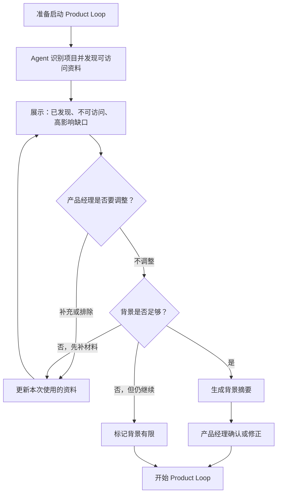
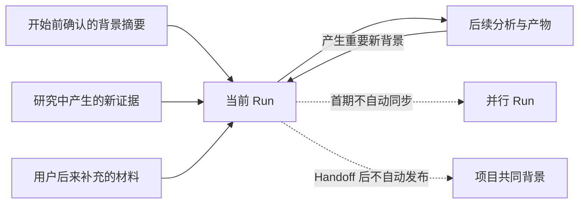

# BPG-PRD-PLANNING-CONTEXT-001_规划上下文准备_v0.1_2026-08-24

## 阅读摘要

- **结论**：本需求成立，但首期只做“本次规划开始前的上下文准备”，不做项目级知识版本管理。
- **本次增量**：在每次 Product Loop 开始前，Agent 先发现项目资料，产品经理审核或补充，再形成一份供本次规划使用的共同背景。
- **主要对象与场景**：产品经理准备在一个已有项目中规划需求、反馈或问题；项目已有文档和代码，不应要求他重新口述整个项目。
- **本期范围**：确认当前项目、发现可访问资料、说明高影响缺口、人工补充或排除、生成背景摘要，以及保证当前 Run 持续吸收自己的新材料。
- **明确不做**：不建立项目级共享上下文版本，不做 Refresh、Handoff 后自动更新、并行 Run 同步、完整知识库治理或当前问题研究。
- **当前状态**：候选需求稿。它不代表功能已实现、测试通过、已交接或上线。
- **版本关系**：本稿以新的需求身份取代 `BPG-PRD-PROJECT-BOOTSTRAP-001 v0.3` 作为当前实现目标；旧稿和预览稿继续保留。
- **下一步**：完成独立产品、工程和可测试性审查；通过需求就绪检查后，再交给研发规格和 Test Graph。

## 1. 问题、目标与价值

### 1.1 问题定义

产品经理开始规划已有项目中的具体问题时，资料通常散落在产品文档、历史 PRD、架构、Roadmap、知识库和代码仓库里。

当前有两种都不理想的做法：

1. 让产品经理从头讲一遍项目，费时且容易遗漏。
2. Agent 直接进入当前问题研究，可能忽略已有约束、重复旧结论。

原 Project Bootstrap 试图同时解决项目级共享版本、Refresh 和跨 Run 同步，范围超过了当前最直接的冷启动问题。

### 1.2 目标

- **GOAL-001**：在 Product Loop 开始前，产品经理能快速确认 Agent 找到了什么、还缺什么，以及本次工作将基于什么背景开始。
- **成功的可观察状态**：用户不必重述整个项目；重要材料与缺口可见；确认后可以直接开始规划；当前 Run 后来产生的新材料会被后续步骤使用。
- **不能牺牲的边界**：未读取或未确认的内容不能写成事实；准备过程不能无限阻塞用户；不得暗示多个 Run 已共享最新背景。
- **停止或改判条件**：如果准备过程比直接说明更费力，或单个 Run 的背景仍频繁因跨 Run 变化失真，应停止扩展当前方案并重新评估 Knowledge Maintenance。

### 1.3 价值与时机

- **用户价值**：少做重复说明，更早发现会影响本次规划的背景缺口。
- **团队价值**：减少因遗漏已有约束造成的返工，让后续讨论从同一组已确认事实开始。
- **产品价值**：先交付最小冷启动能力，把共享知识治理留给真正负责它的 Knowledge Maintenance Graph。
- **为什么现在处理**：旧 Bootstrap 已因版本、刷新和并行同步不断变重；继续沿旧范围写下去，会推迟最直接的用户价值。

### 1.4 证据边界

| 结论 | 依据 | 当前边界 |
|---|---|---|
| 首期应收缩为本次规划前的材料准备 | Owner 决策 `decision-ce4c47ecea21` | 已确认的产品方向，不代表效果已验证 |
| 共享版本与 Refresh 不属于本期 | Product Plan v1 与 BPG 架构中的 Knowledge Maintenance 边界 | 未来仍可独立立项 |
| 轻量准备能否明显减少遗漏和重复口述 | 当前问题审计与学习结果 | **UNK-001，待验证**；不阻止形成首期需求 |

## 2. 范围与交付切片

### 2.1 本期范围

| SCOPE-ID | 本期能力 | 用户结果 | 交付边界 |
|---|---|---|---|
| SCOPE-001 | 识别当前项目并发现可访问资料 | 先看到系统已经知道什么 | 项目明确时不重复询问；有歧义时才请用户确认 |
| SCOPE-002 | 审核资料与重要缺口 | 用户可以补充、排除或纠正 | 只影响本次规划，不删除原资料或改变权限 |
| SCOPE-003 | 形成并确认规划背景摘要 | Product Loop 基于共同背景开始 | 摘要随当前 Run 保留，但不是共享项目版本 |
| SCOPE-004 | 保持当前 Run 的背景连续 | 后续步骤吸收本 Run 新材料，暂停后可继续 | 不自动同步到其他 Run，也不静默改写已完成产物 |

### 2.2 明确不做

- 不维护多个 Run 共用的“最新项目上下文”。
- 不生成项目级上下文版本，不提供 Refresh。
- 不在 Handoff 后自动更新共同背景，不协调并行 Run。
- 不负责账号认证、凭证和高级同步参数；已授权且当前可访问的来源可以被发现。
- 不替代 Product Loop 对当前需求、反馈或问题的研究。
- 不建设模板、权限体系、完整知识库或 Operational Readiness Gate。

### 2.3 适用范围与兼容边界

- **适用场景**：一个已经存在项目资料、准备启动具体 Product Loop 的产品经理。
- **适用来源**：当前 Host 已能访问的项目文件、文档、知识来源，以及用户在本次准备中补充的材料。
- **用户可跳过**：资料不足或用户希望直接开始时，可以带着明确的“背景有限”提示进入 Product Loop。
- **命名**：用户界面优先使用“准备规划背景”或“建立本次规划背景”；产品能力名为“规划上下文准备（Planning Context Preparation）”。它不再叫 Project Bootstrap，因为不是一次性项目接入；`init` 也不是用户能力名称。

### 2.4 依赖与共享边界

| DEP-ID | 依赖或边界 | 状态 | 影响与处理 |
|---|---|---|---|
| DEP-001 | 当前 Host 可访问的项目工作区与资料 | 已确认边界 | 无法访问的来源标为不可用，不推断其内容 |
| DEP-002 | Product Loop 使用已确认的本次背景 | 本期需要 | 未确认时允许跳过，但必须显示背景有限 |
| DEP-003 | Knowledge Maintenance 负责未来共享背景 | 未来能力 | 当前只保留产品边界，不预设实现方式 |

### 2.5 后续规划

| 后续方向 | 与本期关系 | 启动条件 | 本期必须保持的边界 |
|---|---|---|---|
| 项目共同背景维护 | 未来接管共享版本、Refresh、Handoff 后更新和并行 Run 协调 | 出现可复现的跨 Run 背景过期或冲突 | 本期摘要必须可被当前 Run 解释，但不能冒充统一项目知识 |

### 2.6 与旧需求的关系

本 PRD **supersedes** `BPG-PRD-PROJECT-BOOTSTRAP-001 v0.3`，仅指取代它作为当前前向实现依据，不改变旧稿的历史状态。

本 PRD **invalidates** 旧稿中的四项首期假设：

1. 首期必须生成项目级上下文版本。
2. Product Loop 必须绑定并固定读取某个共享版本。
3. Refresh 属于当前 Project Bootstrap 路线。
4. BPG 首期要解决 Handoff 后更新与并行 Run 同步。

## 3. 方案总览与关键流程

### 3.1 方案概述

这一能力像“开会前把资料摊在桌上”：Agent 先说明自己找到了什么，再让产品经理删掉不该用的、补上关键缺口，最后用几段话总结本次规划的共同背景。确认后才进入具体问题研究。

### 3.2 模块概览

**图 1｜这项能力由哪几段组成？**

这张图只说明本期模块及未来责任边界，不描述工程组件。四个实线模块属于本期；跨 Run 共享属于未来能力。

| MOD-ID | 模块 | 职责 |
|---|---|---|
| MOD-001 | 资料发现 | 识别项目，展示已发现资料和访问状态 |
| MOD-002 | 审核与缺口 | 让用户补充、排除、纠正，并解释重要缺口 |
| MOD-003 | 背景摘要 | 形成一份可确认、可回看的本次规划背景 |
| MOD-004 | Run 内连续性 | 后续步骤使用本 Run 新材料，恢复后不丢失实际背景 |

### 3.3 端到端流程

**图 2｜用户怎样从进入项目走到开始规划？**

- **视图范围**：回答正常路径、材料不足和用户跳过时如何开始；不覆盖进入 Product Loop 后的具体问题研究。
- **关键判断**：Agent 可以建议“还缺什么”，但由产品经理决定补充、排除、继续或跳过。
- **异常与恢复**：来源不可访问时保留可见状态；准备中断后恢复到上次审核位置，不要求用户重做。

### 3.4 当前 Run 如何使用新材料

**图 3｜为什么当前 Run 不会永远停在最初摘要？**

- **核心行为**：摘要是起点，不是锁死的版本。当前 Run 每得到一份新材料，后续步骤都应使用它。
- **关键边界**：已经完成的结论不被静默改写；新材料若推翻旧结论，Agent 必须指出冲突并建议回到受影响步骤。
- **跨 Run 限制**：并行 Run 不会自动获得这些变化；这项能力留给未来 Knowledge Maintenance。

### 3.5 全局产品规则与状态

| RULE-ID | 产品规则 |
|---|---|
| RULE-001 | 项目明确时直接展示识别结果；只有存在高影响歧义时才请用户确认 |
| RULE-002 | Agent 必须先说明已发现内容，再询问缺口，不能默认要求用户重述项目 |
| RULE-003 | 只有实际可访问且未被用户排除的材料，才能进入本次背景 |
| RULE-004 | 缺口按对当前规划的影响分级；低影响缺口不能阻止开始 |
| RULE-005 | 用户排除来源只影响本次 Run，不删除原资料、不改变权限 |
| RULE-006 | 新材料从被接受或生成后影响后续步骤；与既有结论冲突时显式提醒 |
| RULE-007 | 任何页面和摘要都不能把 Run 内背景描述为多个 Run 共用的最新项目知识 |

| 状态 | 用户看到什么 | 可执行动作 |
|---|---|---|
| 发现中 | 正在查找当前可访问资料 | 等待或取消 |
| 待审核 | 已发现资料、不可访问来源和重要缺口 | 补充、排除、纠正、继续 |
| 可开始 | 背景摘要与残余缺口 | 确认、修改或返回审核 |
| 背景有限 | 用户选择在重要资料不足时继续 | 开始 Product Loop 或补材料 |
| 已开始 | 当前 Run 使用确认背景和自己的新材料 | 正常规划；出现冲突时回看受影响步骤 |

## 4. 功能与规则详述

### 4.1 MOD-001｜资料发现

**模块目标**：让用户先看到 Agent 已经知道什么，而不是先被要求讲一遍项目。

- 触发：用户准备在一个项目中启动 Product Loop。
- 完成：展示项目识别、已发现资料、不可访问来源和可能的高影响缺口。
- 规则：发现范围只包含当前可访问来源；每项资料要能让用户认出它是什么、来自哪里、当前是否可用。
- 反馈：项目有歧义时，说明为什么无法确定并只询问必要信息。

| 异常 | 预期处理 |
|---|---|
| 没找到资料 | 明确说“未发现”，建议最少需要的材料；允许用户补充或带背景有限提示继续 |
| 来源不可访问 | 显示不可访问及原因；不把连接成功等同于内容可用 |
| 发现大量低相关资料 | 优先展示最可能影响规划的资料，其余可展开查看 |

- **AC-001**：Given 项目中存在可访问资料，When 进入准备环节，Then 用户先看到发现结果，而不是先收到“请描述整个项目”。
- **AC-002**：Given 项目身份明确，When 开始发现，Then 系统不重复要求确认项目；存在歧义时才展示候选和理由。
- **AC-003**：Given 某来源不可访问，When 展示结果，Then 其状态与可访问资料明确区分，且内容不被推断。

### 4.2 MOD-002｜审核与缺口

**模块目标**：由产品经理决定本次规划使用哪些资料，并知道哪些缺口真的重要。

- 用户可以补充文件、文档或当前可访问的来源，也可以排除发现结果。
- Agent 应解释缺口可能影响什么判断，不用“资料不完整”笼统阻塞用户。
- 发现相互冲突的材料时，展示冲突和来源；用户可以选择采用其中一个，也可以保留为未解决事项。
- 所有调整只作用于本次 Run。

| 异常 | 预期处理 |
|---|---|
| 用户补充的材料仍不可访问 | 保留失败状态和补救建议，不假装已经纳入 |
| 两份资料互相冲突 | 展示冲突点、来源和可能影响；未解决时写入摘要 |
| 用户排除关键资料 | 说明可能影响，但尊重选择并允许继续 |

- **AC-004**：Given 已发现资料，When 用户排除一项，Then 它不进入本次背景，原资料和权限保持不变。
- **AC-005**：Given 用户补充可访问材料，When 系统重新评估，Then 发现列表和缺口说明随之更新。
- **AC-006**：Given 存在材料冲突，When 用户未作选择，Then 冲突保持可见，不能被摘要成单一事实。

### 4.3 MOD-003｜背景摘要与开始规划

**模块目标**：用一份短摘要建立共同理解，让用户确认后开始 Product Loop。

摘要至少回答：

1. 这是哪个项目，本次准备处理什么问题。
2. 哪些材料构成主要依据。
3. 已知的产品目标、关键约束和既有决定是什么。
4. 还有哪些会影响本次规划的缺口或冲突。

摘要不复制整份知识库，也不提前研究当前问题。产品经理可以直接修改或要求 Agent 重新总结。

- **AC-007**：Given 资料审核完成，When 生成摘要，Then 摘要覆盖项目、主要依据、关键背景和残余缺口，且不把未知写成事实。
- **AC-008**：Given 用户修正摘要，When 再次确认，Then Product Loop 使用修正后的内容开始。
- **AC-009**：Given 重要资料不足但用户选择继续，When 开始 Product Loop，Then 用户看到明确的“背景有限”状态及其影响。
- **AC-010**：Given 用户未确认摘要，When 系统仍在准备阶段，Then 不得把该摘要描述为已确认背景。

### 4.4 MOD-004｜当前 Run 连续性

**模块目标**：让摘要成为当前 Run 的起点，而不是一张永远不变的旧照片。

- 当前 Run 新生成或新接受的材料，从下一步开始进入工作背景。
- 新材料与既有结论一致时，后续直接使用。
- 新材料推翻已有结论时，Agent 必须说明受影响内容，并建议修订或返回相应步骤。
- 暂停后恢复时，应继续使用本 Run 实际采用的背景和后来材料。
- 当前 Run 的变化不会自动发布到并行 Run 或项目共同背景。

| 异常 | 预期处理 |
|---|---|
| 恢复时部分材料不可用 | 说明缺失内容及影响，保留其历史存在事实，允许重新提供或降级继续 |
| 新材料推翻旧结论 | 不静默覆盖；指出冲突、受影响产物和建议动作 |
| 并行 Run 使用旧背景 | 明确首期不支持自动同步，不把任一 Run 宣称为统一最新版本 |

- **AC-011**：Given 当前 Run 产生新材料，When 进入后续步骤，Then Agent 的分析能引用并使用该材料。
- **AC-012**：Given 新材料推翻先前结论，When Agent 继续工作，Then 它先指出冲突和受影响范围，不静默改写历史。
- **AC-013**：Given Run 在确认背景后暂停，When 恢复，Then 用户无需重新审核全部资料即可继续。
- **AC-014**：Given 两个 Run 并行，When Run A 产生新材料，Then 系统不声称 Run B 已自动获得该材料。

## 5. 验收与产品评估

### 5.1 整体验收边界

- **最低条件**：SCOPE-001 至 SCOPE-004 形成完整闭环；正常、无资料、不可访问、冲突、跳过、恢复、新材料改判和并行 Run 限制均有可观察结果。
- **不能只靠文档判断**：发现结果是否有用、摘要是否足够清楚、实际能减少多少重复说明和遗漏，需要实现后的 Product Evals 或内部试用验证。
- **回归范围**：现有 Signal Intake、Product Loop 启动、Run 暂停与恢复，以及旧 Bootstrap 文档引用关系。

| GOAL / SCOPE | 主要验收 | 状态 |
|---|---|---|
| GOAL-001 / SCOPE-001 | AC-001～AC-003 | 需求已定义，未执行测试 |
| SCOPE-002 | AC-004～AC-006 | 需求已定义，未执行测试 |
| SCOPE-003 | AC-007～AC-010 | 需求已定义，未执行测试 |
| SCOPE-004 | AC-011～AC-014 | 需求已定义，未执行测试 |

### 5.2 Product Evals 适用性与准备状态

| 项目 | 内容 |
|---|---|
| 适用性 | 建议增加 Evals |
| 理由 | 普通 AC 能验证流程，但不能独立判断发现结果和摘要是否真正帮助零背景产品经理理解项目 |
| 准备状态 | 尚未开始 |
| Eval Pack | 尚未生成 |
| 执行状态 | `NOT_RUN` |

建议至少观察三件事：用户能否正确指出本次使用的材料、能否识别残余缺口、能否在不重述整个项目的情况下开始规划。

### 5.3 测试设计参考

后续 Test Graph 应覆盖 AC-001～AC-014，重点组合以下场景：无资料、部分不可访问、用户排除关键来源、来源冲突、准备中断、确认后新增材料、恢复后材料缺失、两个 Run 并行。这里仅提供产品测试意图，不代表测试已设计或执行。

## 7. 兼容、灰度、降级与回滚

### 7.1 版本与旧稿兼容

- 旧 `BPG-PRD-PROJECT-BOOTSTRAP-001 v0.3` 与所有预览稿原样保留。
- 新稿启用后，前向实现和评审应引用 `BPG-PRD-PLANNING-CONTEXT-001 v0.1`。
- 已按旧稿开展的工作不能自动视为满足新稿；需要按新范围重新映射。

### 7.2 降级与回滚

- 资料发现失败时，退化为用户手动补充材料；不能假装已经完成发现。
- 用户跳过或背景仍有限时，允许进入 Product Loop，但持续显示限制。
- 如果该环节显著拖慢启动或持续误导用户，可停止新增入口并恢复为直接进入 Product Loop；旧 PRD 和 Run 记录不删除。
- 回滚不删除当前 Run 已产生的材料；恢复后应能解释当时使用了什么背景。

## 11. 风险、假设与未决事项

### 11.1 主要风险

| RISK-ID | 风险 | 发生信号 | 处理 |
|---|---|---|---|
| RISK-001 | 准备流程过重 | 用户需要长时间整理资料才能开始 | 只追问高影响缺口，允许跳过 |
| RISK-002 | 摘要看似完整但事实失真 | 用户频繁纠正来源或结论 | 强制区分依据、冲突和未知；用 Evals 检查 |
| RISK-003 | 用户误以为多个 Run 已同步 | 并行需求出现背景不一致 | 在状态、摘要和恢复提示中明确 Run 内边界 |
| RISK-004 | 新材料没有影响后续步骤 | Agent 继续沿用已被推翻的结论 | 显式冲突提醒并返回受影响步骤 |

### 11.2 假设与未知

| ID | 类型 | 内容 | 当前处理 | 改判条件 |
|---|---|---|---|---|
| ASM-001 | 假设待验证 | 先自动发现再人工审核，比要求用户从头描述更省力 | 首期暂时采用，后续 Evals 验证 | 多数用户仍选择从头说明或准备耗时更长 |
| UNK-001 | 未知 | 背景摘要做到多深才既够用又不拖慢启动 | 以“支持本次规划”为准，不设固定篇幅 | 摘要频繁遗漏关键约束或持续过长 |
| UNK-002 | 未知 | 何时必须建设跨 Run 共同背景 | 作为残余未知，不阻塞本期 | 出现可复现的并行冲突、过期或重复维护成本 |

## 附录 A：支撑材料

- Owner 原始决策：`.better-product-graph/runs/run-ce4c47ecea21/artifacts/raw-signal-v1.json`，`sha256:b6d748efef51898d2c91d54d857ce2cb6add228c5da4ba193741cfaef2871779`
- 本次 Product Plan：`.better-product-graph/runs/run-ce4c47ecea21/artifacts/PRODUCT_PLAN_PLANNING_CONTEXT_v1.md`，`sha256:7947cac14caf0909074741f59d8d22391baccaa7c095109a6bf96eae5e8b5a61`
- 旧正式 PRD：`artifacts/prds/released/BPG-PRD-PROJECT-BOOTSTRAP-001_项目接入与初始上下文_v0.3_2026-08-24/BPG-PRD-PROJECT-BOOTSTRAP-001_项目接入与初始上下文_v0.3_2026-08-24.md`，`sha256:ac524d0985a0dabc66fe0dd05e90a3151bdae4be481d43359c03405ad2e8ed73`
- BPG 架构：`docs/architecture/PRD_GRAPH_v1.4.md`，`sha256:f03ee71c0dde313b8227eaf5384d6ed3b20a0d906b66606fd5a0d28ee9007a29`

## 附录 B：决策与变更依据

| 决策 | 结论 | 依据 | 对本 PRD 的影响 |
|---|---|---|---|
| 是否继续旧 Bootstrap 范围 | 否，改为本次规划前的轻量材料准备 | `decision-ce4c47ecea21` | 创建新 PRD 身份，旧稿保留 |
| 是否锁定项目级上下文版本 | 否 | Owner 决策与 Product Plan v1 | 摘要只随当前 Run 保留 |
| Refresh 与并行同步归谁 | 未来 Knowledge Maintenance Graph | Product Plan v1 | 本期只披露不支持，不预设实现 |

## 附录 C：文档变更日志

| PRD 版本 | 日期 | 变更人 | 主要变更 | 变更类型 | Supersedes | Review / Release 影响 |
|---|---|---|---|---|---|---|
| v0.1 | 2026-08-24 | Codex / eli | 首次形成“规划上下文准备”候选 PRD；收缩共享版本、Refresh 与跨 Run 范围 | 产品语义 | `BPG-PRD-PROJECT-BOOTSTRAP-001 v0.3` 的前向实现目标 | 需要重新审查；不继承旧稿 Ready、测试或发布状态 |

## 附录 D：交付检查与覆盖索引

| 检查项 | 结论 | 依据或下一步 |
|---|---|---|
| Product Evals | 建议增加；尚未开始，`NOT_RUN` | 第 5.2 节 |
| 实验型交付合同 | 不适用｜本次决策是直接进入产品规划，不是产品实验 | Product Decision |
| 测试设计 | 尚未完成｜由后续 Test Graph 根据 AC-001～AC-014 形成 | 第 5.3 节 |
| 数据上报 / BI | 不适用｜当前没有可靠量化目标，本期先用 AC 与 Evals 观察 | GOAL-001、UNK-001 |
| 多语言 | 不适用｜首期工作语言为中文，未形成多市场范围 | SCOPE-001～SCOPE-004 |
| 无障碍 | 待后续交互设计检查｜本 PRD 未指定具体界面形态 | 进入设计前确认 |
| 外部认证与第三方同步 | 不适用｜属于独立 Settings 与 Connector 能力 | 第 2.2 节 |
| 法律、合规与内容安全 | 不涉及｜本期不新增数据类别、外部共享或公开内容 | 需求边界；若实现改变则重新审查 |
