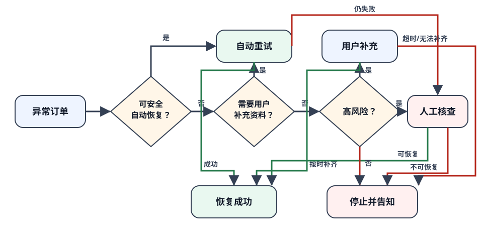

# 异常订单恢复分流

## 一页结论

订单处理异常后，系统按照是否可安全自动恢复、是否缺少必要资料、是否涉及高风险来选择处理路径。只有服务端确认恢复完成，订单才回到正常履约；不能恢复时明确结束并说明原因，不让用户持续等待一个不会完成的订单。

## 这张图回答什么

下图集中表达异常订单如何分流、每条支路由谁推进，以及怎样回到正常履约或结束。正文不再逐节点重复这套关系。

## 图的文字替代

系统先识别异常是否可以安全重试；可重试的异常由系统恢复，缺少资料时暂停并通知提交，按时补齐后继续恢复，超过截止时间或无法补齐则停止并说明原因；高风险异常交给人工判断。只有服务端确认后订单才回到履约。

## 产品规则

- 自动恢复最多执行两次；每次都必须幂等，不能重复扣款、占库存或发货。
- 需要补资料时，订单保留当前资源到明确截止时间；超时后按不可恢复处理。
- 高风险订单在人工结论前不继续履约，也不向用户虚报“处理中即将完成”。
- 所有支路都保留异常原因、处理责任方、最后更新时间和最终结果。
- 页面只有收到服务端确认后才展示“处理完成”。

## 失败、风险与未知

恢复服务本身失败时，订单保持原异常状态并转人工，不继续无限重试。主要风险是多条异常信号同时到达造成重复动作；系统以同一订单的一条有效恢复流程为准。当前未知是资料提交的合理等待时长，不同业务线可配置，但必须向用户显示截止时间。

## 验收

- 可安全重试的异常不会直接打断用户，也不会执行超过两次。
- 缺少用户资料时，页面说明缺什么、何时到期以及如何补充。
- 高风险订单只有人工给出结论后才继续或停止。
- 已恢复、已停止和仍在等待三种结果不会混淆。

## 下一步

用可重试、待补资料、高风险和最终不可恢复四组订单回放分流，并由订单与风控负责人确认等待时长和人工处理时限。本需求不规定内部队列或并发实现。
