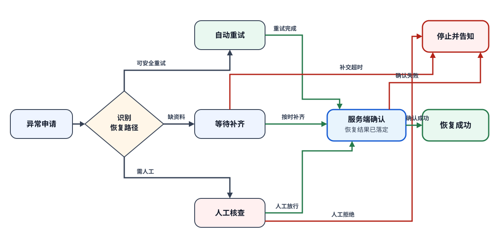

# 资料补交后的申请恢复

## 产品目标

当企业入驻申请因为临时校验失败、资料不完整或高风险信号而中断时，让申请人知道由谁处理、还需做什么以及何时得到结果。系统只在服务端确认恢复完成后显示成功，避免重复申请或虚假的完成状态。

## 一页结论

可安全处理的临时失败自动重试；缺资料的申请等待申请人在截止前补齐；高风险申请由人工判断。自动重试、按时补齐和人工放行都进入同一个服务端确认节点，确认失败则保持异常或停止并告知。所有成功支路都先经过服务端确认。

## 这张图回答什么

下图集中表达三类可继续路径如何汇入服务端确认，以及哪些失败会停止。正文不再逐节点复制图中的所有连线。

## 图的文字替代

申请异常后识别为可安全自动重试、等待补资料或高风险人工核查三条处理路径。自动重试完成、申请人在截止前按时补齐或人工放行，都先由服务端确认恢复结果，只有确认成功才进入恢复成功。补交超时、人工拒绝或确认失败都会保留可解释的失败结果，不会直接写成成功。

## 产品规则

- 自动重试最多两次，每次都沿用原申请身份，不重复创建企业或申请记录。
- 待补资料状态必须显示缺少内容、提交入口和截止时间；超时后停止自动恢复并说明重新申请条件。
- 高风险申请在人工结论前不进入后续开通流程，申请人只能看到真实等待状态。
- 服务端确认要核对申请仍有效、所需资料完整且处理结果已落定；任一条件不满足都不能显示恢复成功。
- 所有支路保留异常原因、当前处理方、最后更新时间和最终结果。

## 可观察验收

- 临时校验失败进入自动重试时，申请人看到重试状态且不会出现第二个申请编号。
- 缺资料时，页面明确显示待补内容、截止时间和补交入口。
- 按时补齐后，页面先显示等待服务端确认，不能直接跳到恢复成功。
- 高风险申请只有人工放行并通过服务端确认后才恢复；人工拒绝时说明结果。
- 服务端确认失败时，申请保持异常并给出下一步，不展示“已恢复”。
- 最终成功、停止和仍在等待三种状态在申请人页面与客服查询中一致。

## 风险与未知

主要风险是资料上传完成事件早于内容可读取时间，导致服务端过早确认失败；产品上保持“等待确认”并允许系统再次核对，不让用户重复上传。当前未知是不同资料类型的合理补交期限，以及人工核查最长响应时间。

## 下一步

用自动重试成功、按时补齐、补交超时、人工放行、人工拒绝和服务端确认失败六组申请回放图与页面状态，再由入驻运营和风控负责人确认补交期限与人工时限。本需求不规定内部队列、锁或重试算法。
